# Flutter / 旧 Web UI Side-by-side 评审

> 状态：评审记录 v0.2
> 日期：2026-07-03  
> 旧 Web reference：`test/screenshots/legacy_web/compact_390x844/`  
> Flutter golden：`flutter_app/test/goldens/feature_pages/`、`flutter_app/test/goldens/agent_hub/`  
> 视口：390x844  

---

## 1. 结论

当前 Flutter 390x844 主路径已经对齐旧 Web 的整体结构和视觉语言，可作为非真机 UI 迁移基线。

本轮 side-by-side 评审结论：

| 类别 | 数量 | 页面 |
|---|---:|---|
| 结构通过 | 15 | Agent Hub、Status、Schedule、Device、Device Manage、Device User、W1、Hospital Bag、IBCLC、Media Viewer、Pump、Calibration、Records、Community、Not Found |
| 需修正 | 0 | - |
| 需深状态补图后复核 | 0 | - |

剩余产品决策项：

1. Records 显式编辑按钮是否替代旧 Web swipe reveal，需要产品确认。
2. W1 营销素材和最终文案，需要产品确认。

---

## 2. 评审规则

本记录不做像素级 diff，而是按以下维度评审：

- 信息架构：入口、模块顺序、页面归属是否一致。
- 首屏结构：标题、卡片、底栏、专注流程、主要 CTA 是否一致。
- 可见控件：旧 Web 首屏可见按钮、价格、删除、步数、badge 是否保留。
- 移动适配：390x844 下不裁切、不露半张卡、不缺底栏 tab。
- 文案和数据：主文案、日期、数量、单位是否明显漂移。

---

## 3. 页面矩阵

| 页面 | 旧 Web | Flutter | 结论 | 记录 |
|---|---|---|---|---|
| Agent Hub `/` | 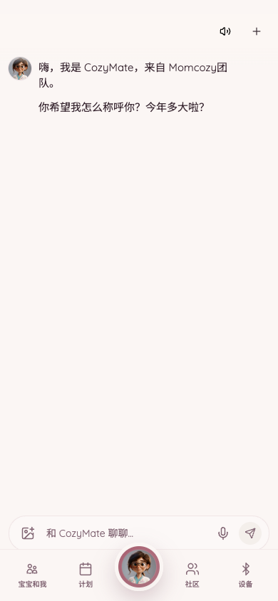 | 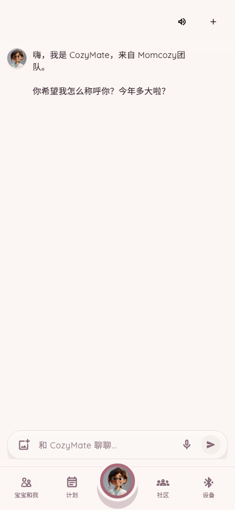 | 结构通过 | 首屏问候、右上图标、底栏结构一致；输入栏已恢复旧 Web 的图片、麦克风、纸飞机同排胶囊样式；已有 rich artifact golden，并补充 streaming、cancelled、disconnected、voice error 三档 viewport 深状态 golden：`flutter_app/test/goldens/agent_hub/`。 |
| Status `/status` | 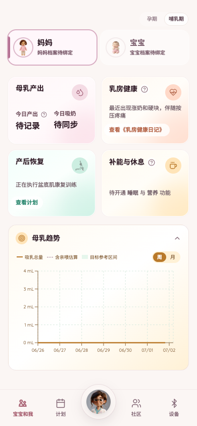 | 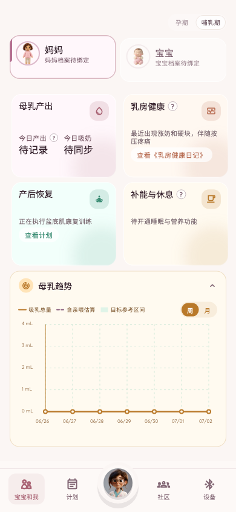 | 结构通过 | 主结构一致；母乳趋势 x 轴已统一为旧 Web reference 的 `06/26` 到 `07/02` 七天窗口；后端失败/空数据不再用错误卡替代首屏，已补妈妈哺乳期、宝宝哺乳期、妈妈孕期三档 viewport offline fallback golden：`flutter_app/test/goldens/status_states/`。 |
| Schedule `/schedule` | 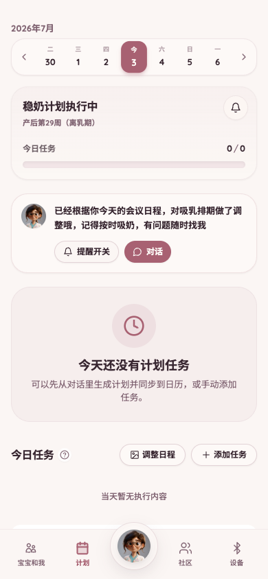 | 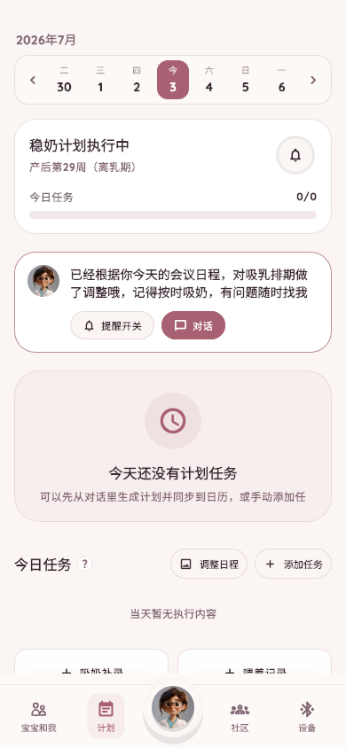 | 结构通过 | 月份、7 日日期条、左右切周箭头、计划卡、Agent 提醒卡、空态、底栏结构一致；接口失败不再把首屏标题改为同步中，也不再用错误卡替代旧版空计划首屏；今日任务工具按钮已恢复旧 Web 图标+文字胶囊，并补充 populated、local task added、sync failed 三档 viewport 深状态 golden：`flutter_app/test/goldens/schedule_states/`。 |
| Device `/device` | 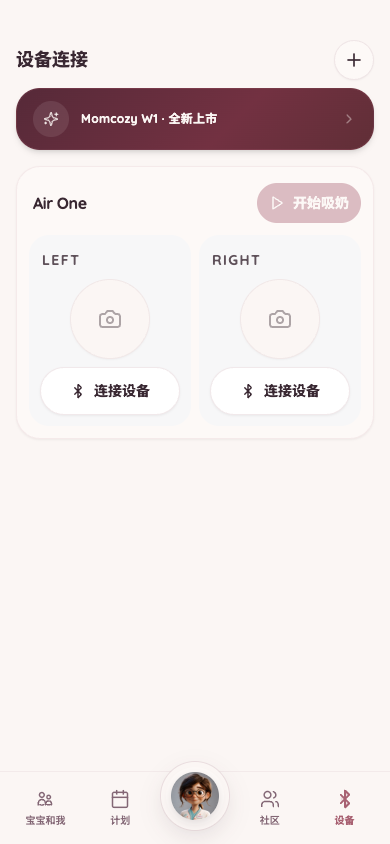 | 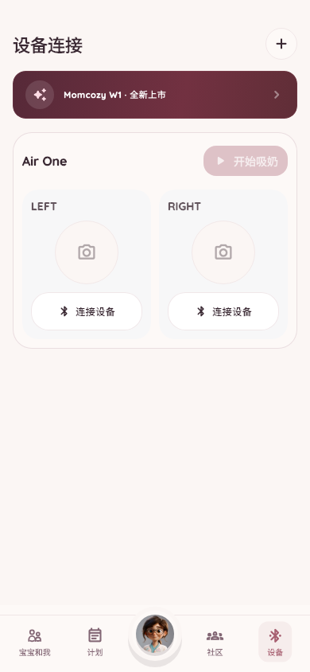 | 结构通过 | 标题、加号、W1 横幅、Air One、左右设备卡和底栏一致。 |
| Device Manage `/device/manage` | 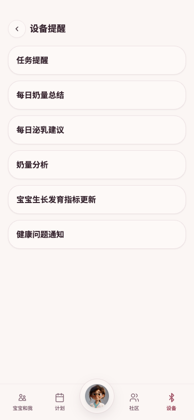 | 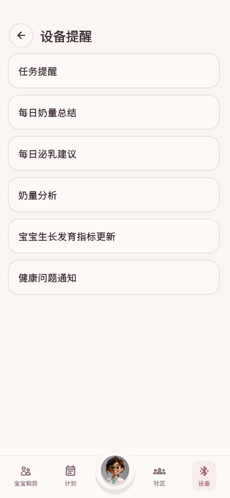 | 结构通过 | 子页结构可接受；已补 loading、offline sync 三档 viewport 深状态 golden：`flutter_app/test/goldens/device_subpages/`。 |
| Device User `/device/user` | 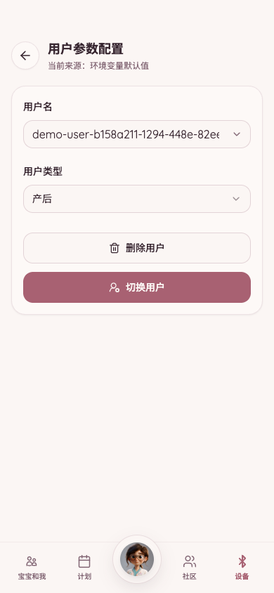 | 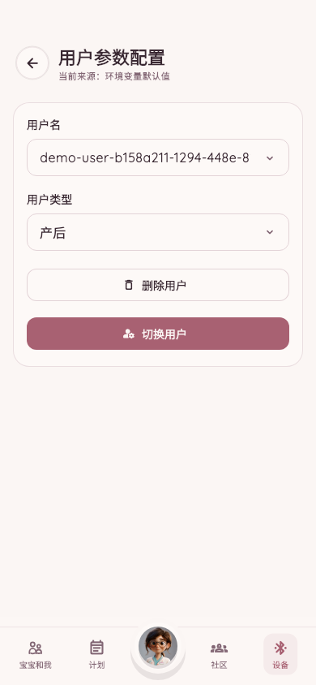 | 结构通过 | 表单结构可接受；已补用户列表展开、保存失败三档 viewport 深状态 golden，并将保存失败状态改为红色错误提示：`flutter_app/test/goldens/device_subpages/`。 |
| W1 `/w1` | 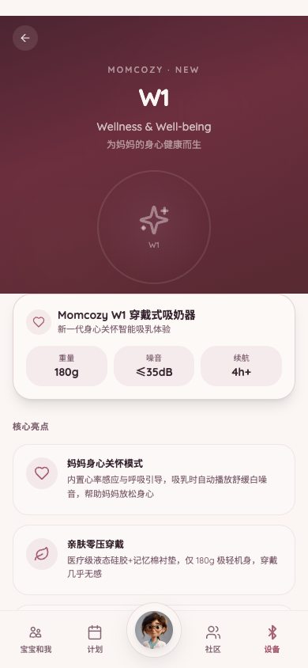 | 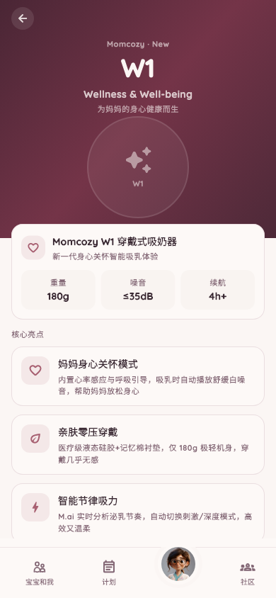 | 结构通过 | 首屏产品页结构、主色和内容密度接近；当前作为工程基线通过，营销素材文案留给产品最终确认。 |
| Hospital Bag `/hospital-bag-cart` | 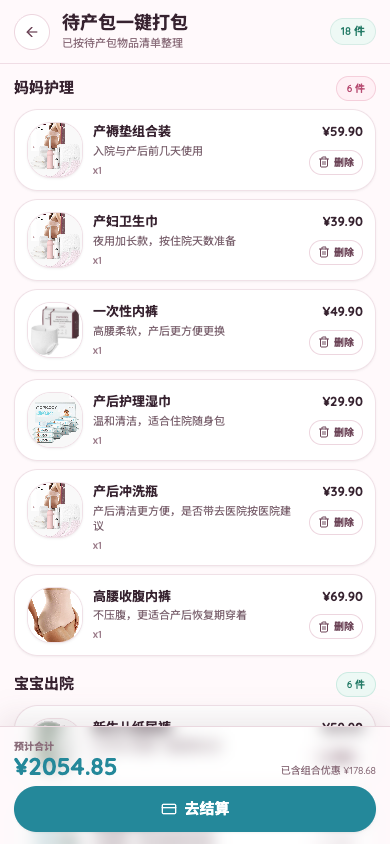 | 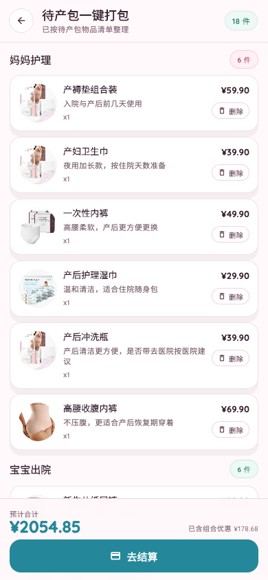 | 结构通过 | Flutter 已恢复分组数量、列表行价格和删除按钮，底部结算栏保持一致。 |
| IBCLC `/ibclc-chat.html` | 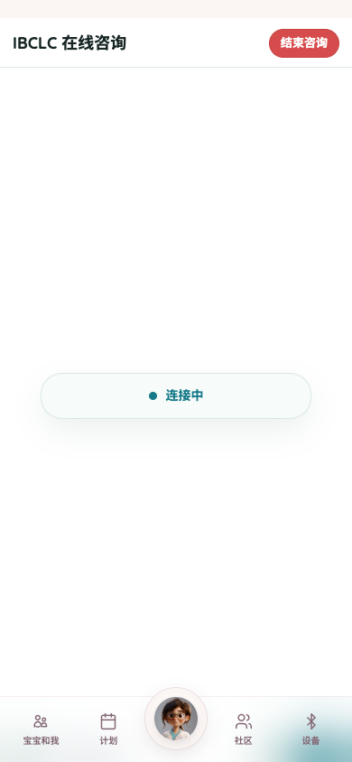 | 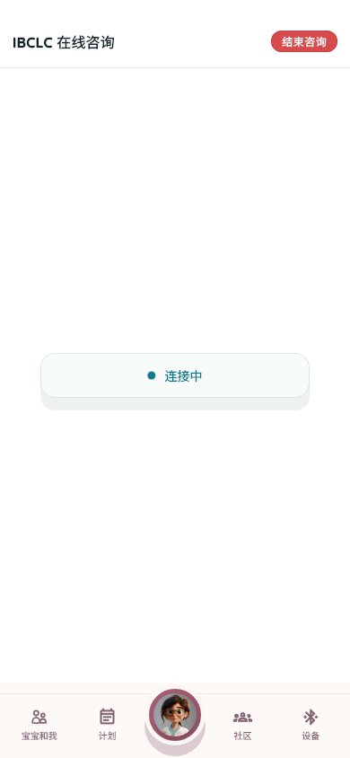 | 结构通过 | 首屏咨询入口结构接近；已补 queue、chat ready synced、local queue failed sync 三档 viewport 深状态 golden：`flutter_app/test/goldens/ibclc_states/`。 |
| Media Viewer `/media-viewer` | 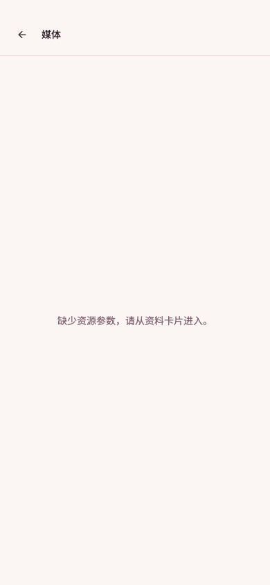 | 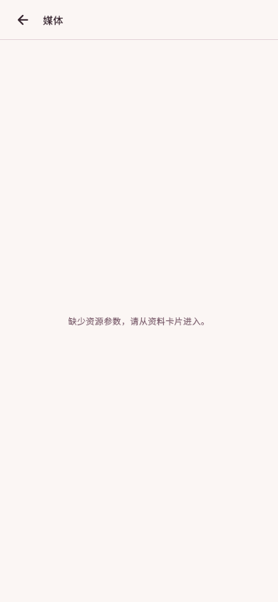 | 结构通过 | 缺资源状态一致；已补 PDF、image、video 三档 viewport 资源状态 golden：`flutter_app/test/goldens/media_viewer_states/`。 |
| Pump `/pump` | 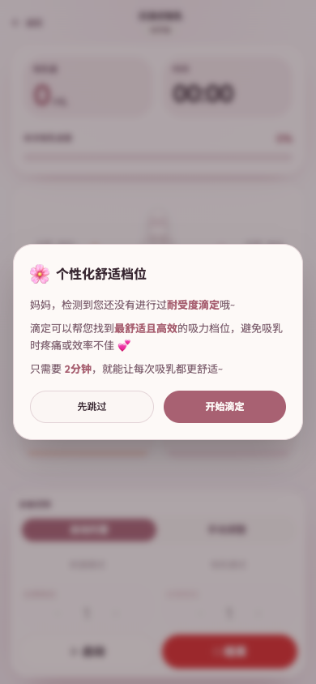 | 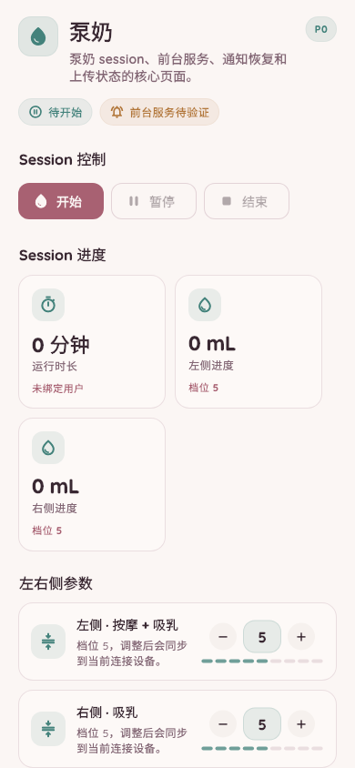 | 结构通过 | 首次校准弹窗结构一致；已补 running、paused、finished locked、upload failed 三档 viewport 深状态 golden：`flutter_app/test/goldens/pump_states/`。 |
| Calibration `/calibration` | 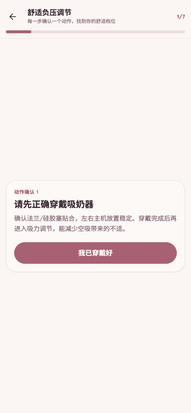 | 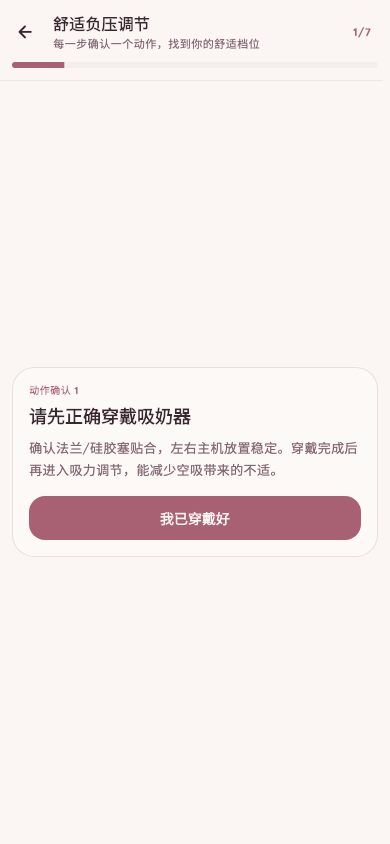 | 结构通过 | 主卡片、进度条、右上 `1/7` 步数文本和 CTA 已对齐；360 窄屏裁切已修复。 |
| Records `/records` | 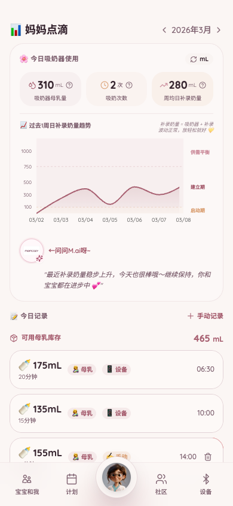 | 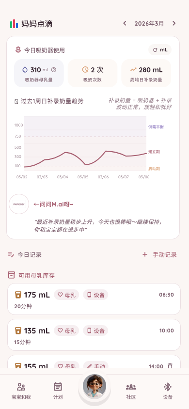 | 结构通过 | 已恢复单位切换、图表右侧阶段标签、分段背景和记录行右侧时间；当前显式编辑/删除按钮作为工程基线通过，是否回退到旧 Web swipe reveal 留给产品确认。 |
| Community `/community` | 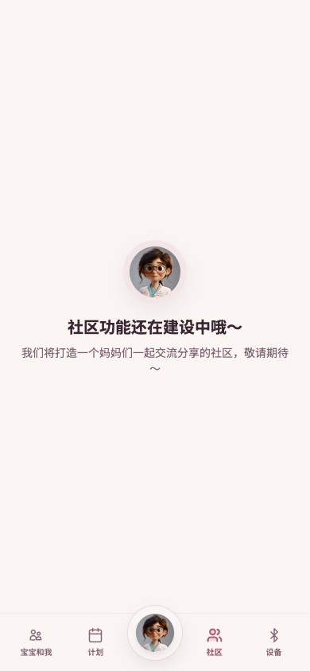 | 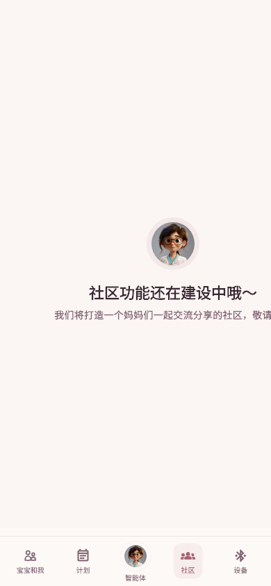 | 结构通过 | 建设中空态结构一致。 |
| Not Found `*` | 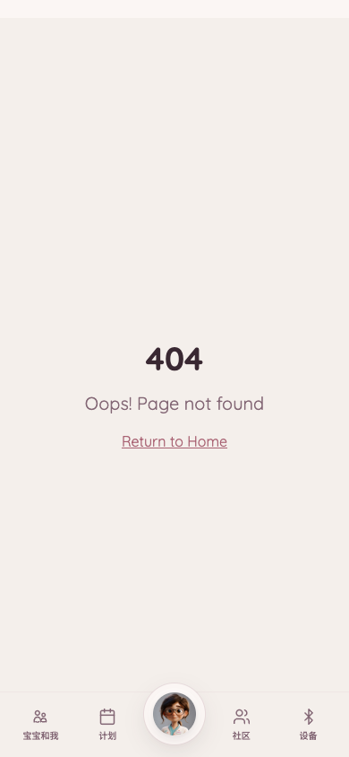 | 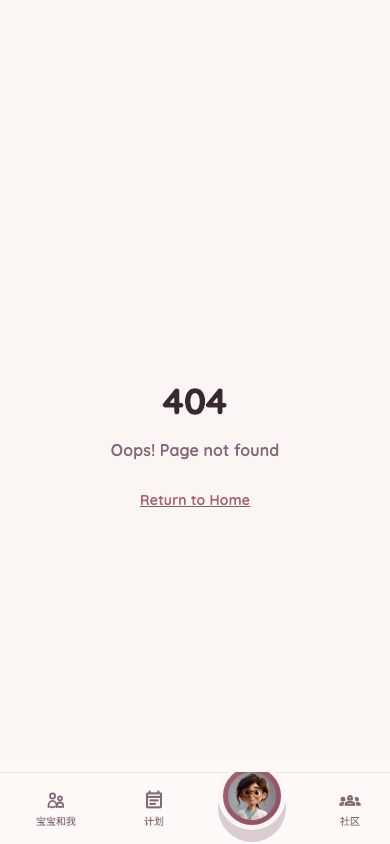 | 结构通过 | 404 fallback 可接受。 |

---

## 4. 修正任务清单

### P1

| ID | 页面 | 问题 | 验收方式 |
|---|---|---|---|
| - | - | 暂无剩余主路径 P1 UI 修正项。 | 后续只在产品决策或真机验证发现偏差时重新开启。 |

### P2 产品决策

| ID | 页面 | 问题 | 验收方式 |
|---|---|---|---|
| UI-P2-001 | Records | 旧 Web 编辑操作主要通过 swipe reveal 暴露；Flutter 当前显式展示编辑/删除按钮。 | 产品确认接受显式按钮，或后续改为 swipe reveal 并保留测试入口。 |
| UI-P2-002 | W1 | Flutter 已保留产品页结构，但营销素材和最终文案不属于工程侧可自动判定内容。 | 产品确认最终素材、文案和价格展示后，再更新 golden。 |

---

## 5. 下一步

主路径 P1 已清空，已补 Status、Schedule、Pump、Agent Hub、IBCLC、Media Viewer 与 Device 子页 deep-state golden；release gate 与 Android emulator smoke 已通过，下一步是后续真机 P0 smoke 和产品决策确认。

后续若产品决策或真机反馈引入 UI 变更，需要：

- 更新 Flutter 360x800、390x844、430x932 golden。
- 运行 `flutter analyze`。
- 运行 `flutter test`。
- 单独提交。
