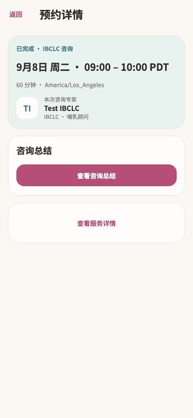

# appointment / completed

复用既有 Flutter 运行图；未重新采集。

进入已完成预约详情 → 查看咨询总结；原专项测试点击并断言目标回调。

已目视检查：内容从顶部至底部全部可见，无须拼接长图。使用受控服务数据；它证明状态渲染与已列按钮动作，不单独证明真实后端或全链路。正常入口沿用页面已有 journey 报告。

- [原图](../../../../../test/goldens/design_system/appointment-completed-390.png)
- [运行日志](../../../../ui-refactor/20260914-appointment-detail/tests.log)
- [本轮核对的源码指纹](source-hashes.json)
- 图片 SHA-256：`d541a32ba4bbe713a6aa66f3fc533bb6fd1a253e39fae689bc96979d19312c95`
