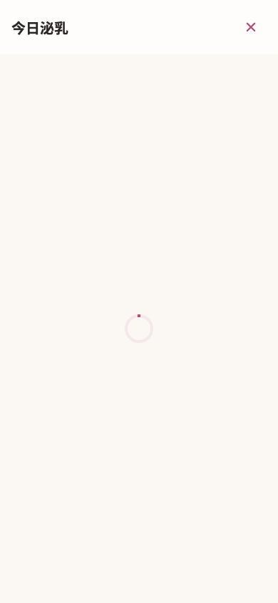

# mom-lactation / 加载

复用既有 Flutter 运行图；未重新采集。

打开今日泌乳 → 请求仍在进行；同一测试随后读取失败 → 重试 → 记录列表。

已目视检查：内容从顶部至底部全部可见，无须拼接长图。使用受控服务数据；它证明状态渲染与已列按钮动作，不单独证明真实后端或全链路。正常入口沿用页面已有 journey 报告。

- [原图](../../../../../test/goldens/ui_refactor/lactation/loading-390-1x.png)
- [运行日志](../../../../ui-refactor/20260914-lactation/joint-tests.log)
- [本轮核对的源码指纹](source-hashes.json)
- 图片 SHA-256：`69a62371aa7b36a2a80e2cf9616a82818905575631b8d5f54b48a674e3b9f3bd`
