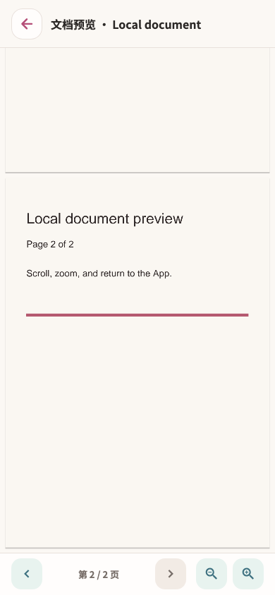

# 当前 PDF page-2

复用当前 Flutter/PDFium 本地两页文档的实际运行图，四个生产文件指纹与已验证交付一致。已目视检查工具栏、页码及文档视口；这是分页／缩放阅读器，不把缩放后画布外的内容当成 Flutter 长表单遗漏。原生两页完整文档与实际翻页路径保留在 [原生资源链](../../NATIVE-RESOURCE-JOURNEYS.md)。

[既有运行记录](../../../../ui-refactor/20260914-media-controls/joint-tests.log) · [原图](../../../../../test/goldens/design_system/media-pdf-page-2-390.png) · [控件交付及限制](../../../../ui-refactor/20260914-media-controls/HANDOFF.md)
