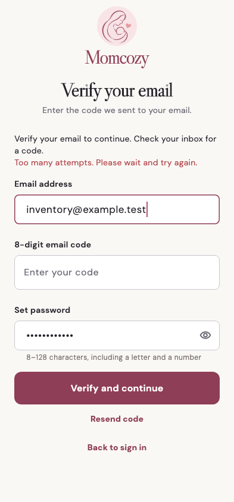

# Momcozy

稳定状态 ID：`01-auth/auth-followup-verify-resend-rate-limited`

- 状态：`auth-followup-verify-resend-rate-limited`
- 范围：viewport
- 数据：组件测试的合成数据，不代表生产账户业务状态。
- 实际执行：`auth unverified login and resend errors retry verify`
- 测试来源：[test/features/auth/auth_followup_inventory_test.dart:180](../../../../test/features/auth/auth_followup_inventory_test.dart)
- [运行元数据、点击轨迹与滚动范围](../../raw/test/goldens/ui_inventory/auth-followup-verify-resend-rate-limited-393-1x.png.json)
- 正常路由链：**已在实际 App 路由中执行**；Open More while signed out → real auth redirect。
- 当前路由：`/login`
- 触发：Resend code → server rate limit
- 证据边界：Actual MomCozyFlutterApp and createMomCozyRouter; only HTTP/session/native-intent dependencies replaced with isolated fixtures

业务写操作均只请求测试传输层；不表示生产账号的数据被修改，也不代表外部服务交易已验收。

前一个已截图状态之后实际发生的指针操作（文字仅为起点附近的几何匹配，可能包含遮挡背景，不等于命中控件；实际目标以测试定位、断言和上述触发说明为准）：

- tap：Resend code

## 其它尺寸与字号

- [auth-followup-verify-resend-rate-limited-393-1x.png](../../raw/test/goldens/ui_inventory/auth-followup-verify-resend-rate-limited-393-1x.png) · 393 × 844
