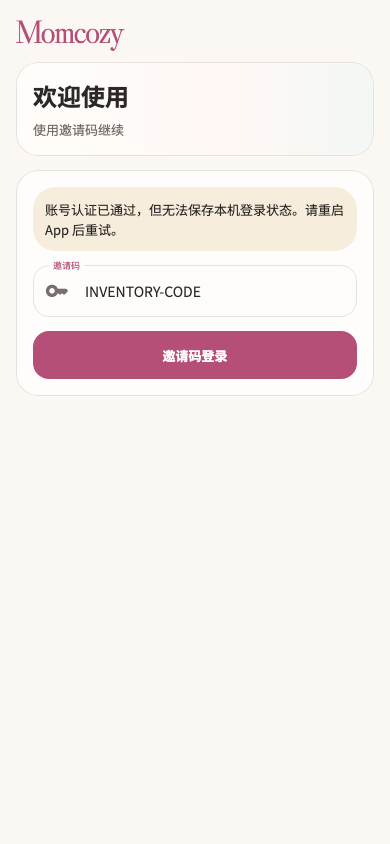

# Momcozy

稳定状态 ID：`01-auth/auth-invite-storage-error`

- 状态：`auth-invite-storage-error`
- 范围：viewport
- 数据：组件测试的合成数据，不代表生产账户业务状态。
- 实际执行：`inventory configured invitation failure outcomes`
- 测试来源：[test/features/onboarding/configured_submission_inventory_test.dart:68](../../../../test/features/onboarding/configured_submission_inventory_test.dart)
- [运行元数据、点击轨迹与滚动范围](../../raw/test/goldens/ui_inventory/auth-invite-storage-error-390.png.json)
- 正常路由链：**已在实际 App 路由中执行**；Configured App entry; real createMomCozyRouter。
- 当前路由：`/login`
- 触发：Retry accepted by server → local session save fails; remains logged out
- 证据边界：Production pages, repositories and router; fixture HTTP and image picker; not an OS picker screenshot

业务写操作均只请求测试传输层；不表示生产账号的数据被修改，也不代表外部服务交易已验收。

前一个已截图状态之后实际发生的指针操作（文字仅为起点附近的几何匹配，可能包含遮挡背景，不等于命中控件；实际目标以测试定位、断言和上述触发说明为准）：

- tap：邀请码登录

## 其它尺寸与字号

- [auth-invite-storage-error-390.png](../../raw/test/goldens/ui_inventory/auth-invite-storage-error-390.png) · 390 × 844
