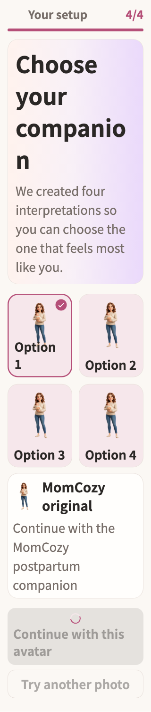

# Your setup

稳定状态 ID：`01-auth/onboarding-avatar-short-confirm-busy`

- 状态：`onboarding-avatar-short-confirm-busy`
- 范围：full-measured-scroll-stitch
- 数据：组件测试的合成数据，不代表生产账户业务状态。
- 实际执行：`avatar short screen retries thumbnail and locks confirmation`
- 测试来源：[test/features/onboarding/onboarding_design_test.dart:65](../../../../test/features/onboarding/onboarding_design_test.dart)
- [运行元数据、点击轨迹与滚动范围](../../raw/test/goldens/design_system/onboarding-avatar-short-confirm-busy-320-2x.png.json)
- 正常用户入口：**待逐项核实**；下方是当前组件与既有映射推导的候选入口，不视为已遍历。

候选入口：`/onboarding /avatar/create /avatar/review`

前一个已截图状态之后实际发生的指针操作（文字仅为起点附近的几何匹配，可能包含遮挡背景，不等于命中控件；实际目标以测试定位、断言和上述触发说明为准）：

- tap：Retry
- tap：坐标 [84.5, 153.82051282051282] → [84.5, 153.82051282051282]
- tap：Continue with this avatar

## 其它尺寸与字号

- [onboarding-avatar-short-confirm-busy-320-2x.png](../../raw/test/goldens/design_system/onboarding-avatar-short-confirm-busy-320-2x.png) · 320 × 568
