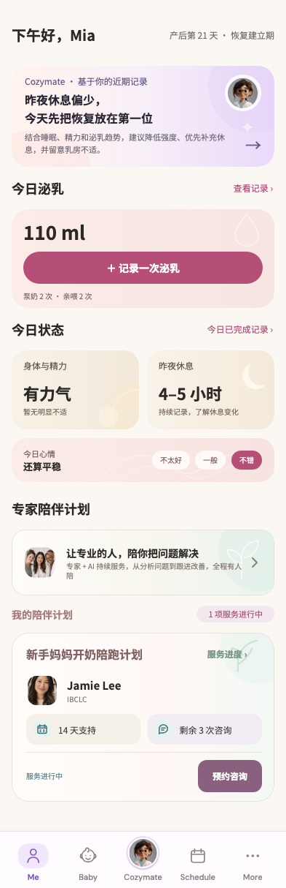

# Cozymate · 基于你的近期记录

稳定状态 ID：`03-mom/mom-handoff-purchased-bottom`

- 状态：`mom-handoff-purchased-bottom`
- 范围：full-measured-scroll-stitch
- 数据：组件测试的合成数据，不代表生产账户业务状态。
- 实际执行：`handoff purchased 393.0/1.0`
- 测试来源：[test/modules/mom/mom_home_handoff_test.dart:245](../../../../test/modules/mom/mom_home_handoff_test.dart)
- [运行元数据、点击轨迹与滚动范围](../../raw/test/goldens/design_system/mom-handoff-purchased-bottom-393-1x.png.json)
- 正常用户入口：**待逐项核实**；下方是当前组件与既有映射推导的候选入口，不视为已遍历。

候选入口：`/me`、`/me /baby / /schedule /more`

前一个已截图状态之后实际发生的指针操作（文字仅为起点附近的几何匹配，可能包含遮挡背景，不等于命中控件；实际目标以测试定位、断言和上述触发说明为准）：

- tap：昨夜休息偏少，
今天先把恢复放在第一位
- tap：让专业的人，陪你把问题解决 / 专家 + AI 持续服务，从分析问题到跟进改善，全程有人陪
- tap：预约咨询
- tap：服务进度 ›

## 其它尺寸与字号

- [mom-handoff-purchased-bottom-320-1x.png](../../raw/test/goldens/design_system/mom-handoff-purchased-bottom-320-1x.png) · 320 × 1100
- [mom-handoff-purchased-bottom-320-2x.png](../../raw/test/goldens/design_system/mom-handoff-purchased-bottom-320-2x.png) · 320 × 1100
- [mom-handoff-purchased-bottom-360-1x.png](../../raw/test/goldens/design_system/mom-handoff-purchased-bottom-360-1x.png) · 360 × 1100
- [mom-handoff-purchased-bottom-360-2x.png](../../raw/test/goldens/design_system/mom-handoff-purchased-bottom-360-2x.png) · 360 × 1100
- [mom-handoff-purchased-bottom-393-1x.png](../../raw/test/goldens/design_system/mom-handoff-purchased-bottom-393-1x.png) · 393 × 1100
- [mom-handoff-purchased-bottom-393-2x.png](../../raw/test/goldens/design_system/mom-handoff-purchased-bottom-393-2x.png) · 393 × 1100
