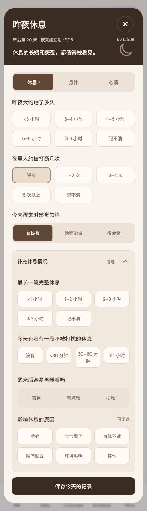

# 下午好，Mia

稳定状态 ID：`03-mom/mom-rest-clear-stretch-cleared`

- 状态：`mom-rest-clear-stretch-cleared`
- 范围：full-measured-scroll-stitch
- 数据：组件测试的合成数据，不代表生产账户业务状态。
- 实际执行：`inventory rest clear and restore 393/1x`
- 测试来源：[test/modules/mom/mom_rest_clear_inventory_test.dart:145](../../../../test/modules/mom/mom_rest_clear_inventory_test.dart)
- [运行元数据、点击轨迹与滚动范围](../../raw/test/goldens/ui_inventory/mom-rest-clear-stretch-cleared-393-1x.png.json)
- 正常路由链：**已在实际 App 路由中执行**；Authenticated More → tap Me bottom navigation。
- 当前路由：`/me`
- 触发：Tap selected 最长一段完整休息 again → no selection
- 证据边界：Actual MomCozyFlutterApp/createMomCozyRouter, production repositories and codecs, isolated in-memory HTTP data, fixed clock and timezone

业务写操作均只请求测试传输层；不表示生产账号的数据被修改，也不代表外部服务交易已验收。

前一个已截图状态之后实际发生的指针操作（文字仅为起点附近的几何匹配，可能包含遮挡背景，不等于命中控件；实际目标以测试定位、断言和上述触发说明为准）：

- tap：记录后，AI 会持续判断奶量与供需趋势 / 记不清

## 其它尺寸与字号

- [mom-rest-clear-stretch-cleared-320-2x.png](../../raw/test/goldens/ui_inventory/mom-rest-clear-stretch-cleared-320-2x.png) · 320 × 844
- [mom-rest-clear-stretch-cleared-393-1x.png](../../raw/test/goldens/ui_inventory/mom-rest-clear-stretch-cleared-393-1x.png) · 393 × 844
