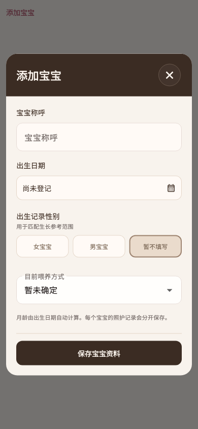

# 添加宝宝

稳定状态 ID：`04-baby/baby-profile-editor`

- 状态：`baby-profile-editor`
- 范围：viewport
- 数据：组件测试的合成数据，不代表生产账户业务状态。
- 实际执行：`profile dialog scrolls and saves at 390.0 / 1.0 / long=false`
- 测试来源：[test/modules/baby/baby_profile_editor_test.dart:68](../../../../test/modules/baby/baby_profile_editor_test.dart)
- [运行元数据、点击轨迹与滚动范围](../../raw/test/goldens/design_system/baby-profile-editor-390.png.json)
- 正常用户入口：**待逐项核实**；下方是当前组件与既有映射推导的候选入口，不视为已遍历。

候选入口：`/baby`

前一个已截图状态之后实际发生的指针操作（文字仅为起点附近的几何匹配，可能包含遮挡背景，不等于命中控件；实际目标以测试定位、断言和上述触发说明为准）：

- tap：添加宝宝

## 其它尺寸与字号

- [baby-profile-editor-320.png](../../raw/test/goldens/design_system/baby-profile-editor-320.png) · 320 × 844
- [baby-profile-editor-390.png](../../raw/test/goldens/design_system/baby-profile-editor-390.png) · 390 × 844
- [baby-profile-editor-430.png](../../raw/test/goldens/design_system/baby-profile-editor-430.png) · 430 × 844
