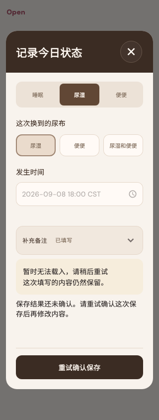

# Open

稳定状态 ID：`04-baby/baby-save-uncertain`

- 状态：`baby-save-uncertain`
- 范围：viewport
- 数据：组件测试的合成数据，不代表生产账户业务状态。
- 实际执行：`collapsed notes preserve the draft and uncertain save retries once`
- 测试来源：[test/modules/baby/baby_editor_states_test.dart:172](../../../../test/modules/baby/baby_editor_states_test.dart)
- [运行元数据、点击轨迹与滚动范围](../../raw/test/goldens/design_system/baby-save-uncertain-320.png.json)
- 正常用户入口：**待逐项核实**；下方是当前组件与既有映射推导的候选入口，不视为已遍历。

候选入口：`/baby /babies/:babyId/records`

前一个已截图状态之后实际发生的指针操作（文字仅为起点附近的几何匹配，可能包含遮挡背景，不等于命中控件；实际目标以测试定位、断言和上述触发说明为准）：

- tap：Open
- tap：补充备注
- tap：补充备注
- tap：坐标 [264.0, 104.0] → [264.0, 104.0]
- tap：已填写 / 继续填写
- tap：保存这次记录

## 其它尺寸与字号

- [baby-save-uncertain-320.png](../../raw/test/goldens/design_system/baby-save-uncertain-320.png) · 320 × 844
