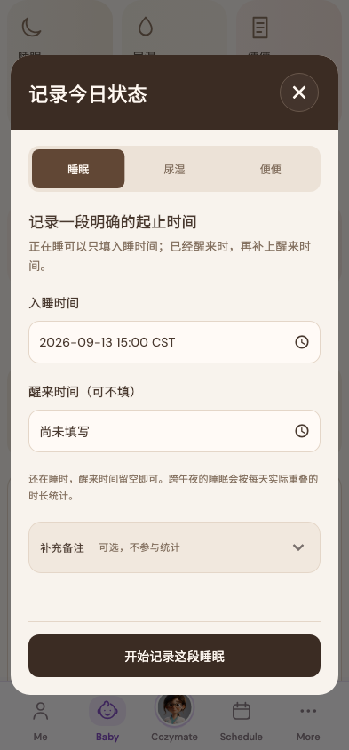

# 睡眠

稳定状态 ID：`04-baby/baby-sleep-controls-start-past`

- 状态：`baby-sleep-controls-start-past`
- 范围：viewport
- 数据：组件测试的合成数据，不代表生产账户业务状态。
- 实际执行：`inventory Baby sleep controls 393/1x`
- 测试来源：[test/modules/baby/baby_sleep_control_inventory_test.dart:163](../../../../test/modules/baby/baby_sleep_control_inventory_test.dart)
- [运行元数据、点击轨迹与滚动范围](../../raw/test/goldens/ui_inventory/baby-sleep-controls-start-past-393-1x.png.json)
- 正常路由链：**已在实际 App 路由中执行**；Authenticated More → tap Baby bottom navigation。
- 当前路由：`/baby`
- 触发：Correct start to 15:00, validation cleared
- 证据边界：Actual MomCozyFlutterApp/createMomCozyRouter, production repositories and codecs, isolated in-memory HTTP data, fixed clock and timezone

业务写操作均只请求测试传输层；不表示生产账号的数据被修改，也不代表外部服务交易已验收。

前一个已截图状态之后实际发生的指针操作（文字仅为起点附近的几何匹配，可能包含遮挡背景，不等于命中控件；实际目标以测试定位、断言和上述触发说明为准）：

- tap：生长发育记录 / 2026-09-13 16:01 CST
- tap：确定
- tap：坐标 [65.5, 632.0] → [65.5, 632.0]
- tap：还在睡时，醒来时间留空即可。跨午夜的睡眠会按每天实际重叠的时长统计。 / 确定

## 其它尺寸与字号

- [baby-sleep-controls-start-past-320-2x.png](../../raw/test/goldens/ui_inventory/baby-sleep-controls-start-past-320-2x.png) · 320 × 844
- [baby-sleep-controls-start-past-393-1x.png](../../raw/test/goldens/ui_inventory/baby-sleep-controls-start-past-393-1x.png) · 393 × 844
