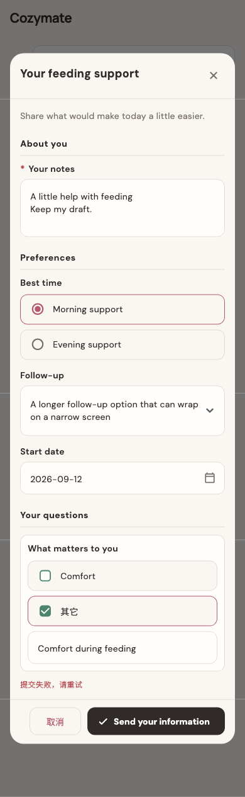

# Your feeding support

稳定状态 ID：`05-agent/agent-form-failed`

- 状态：`agent-form-failed`
- 范围：full-measured-scroll-stitch
- 数据：组件测试的合成数据，不代表生产账户业务状态。
- 实际执行：`form states 390.0/1.0`
- 测试来源：[test/features/agent_hub/agent_form_design_test.dart:56](../../../../test/features/agent_hub/agent_form_design_test.dart)
- [运行元数据、点击轨迹与滚动范围](../../raw/test/goldens/design_system/agent-form-failed-390-1x.png.json)
- 正常用户入口：**待逐项核实**；下方是当前组件与既有映射推导的候选入口，不视为已遍历。

候选入口：`/`

前一个已截图状态之后实际发生的指针操作（文字仅为起点附近的几何匹配，可能包含遮挡背景，不等于命中控件；实际目标以测试定位、断言和上述触发说明为准）：

- 此观察点前没有指针操作记录；可能为直接挂载、异步状态变化或输入事件，需结合测试源码核实。

## 其它尺寸与字号

- [agent-form-failed-320-1x.png](../../raw/test/goldens/design_system/agent-form-failed-320-1x.png) · 320 × 844
- [agent-form-failed-320-2x.png](../../raw/test/goldens/design_system/agent-form-failed-320-2x.png) · 320 × 844
- [agent-form-failed-390-1x.png](../../raw/test/goldens/design_system/agent-form-failed-390-1x.png) · 390 × 844
- [agent-form-failed-390-2x.png](../../raw/test/goldens/design_system/agent-form-failed-390-2x.png) · 390 × 844
- [agent-form-failed-430-1x.png](../../raw/test/goldens/design_system/agent-form-failed-430-1x.png) · 430 × 844
- [agent-form-failed-430-2x.png](../../raw/test/goldens/design_system/agent-form-failed-430-2x.png) · 430 × 844
