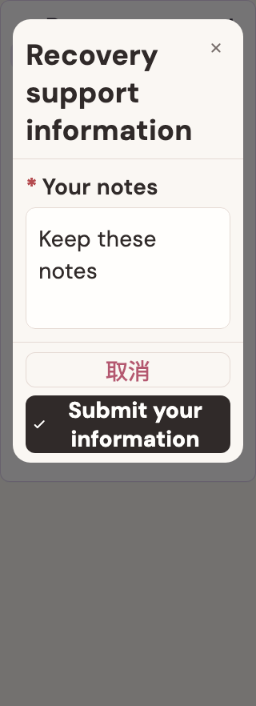

# Recovery support information

稳定状态 ID：`05-agent/agent-form-short-keyboard`

- 状态：`agent-form-short-keyboard`
- 范围：full-measured-scroll-stitch
- 数据：组件测试的合成数据，不代表生产账户业务状态。
- 实际执行：`short screen keyboard leaves form content and actions reachable`
- 测试来源：[test/features/agent_hub/agent_form_design_test.dart:126](../../../../test/features/agent_hub/agent_form_design_test.dart)
- [运行元数据、点击轨迹与滚动范围](../../raw/test/goldens/design_system/agent-form-short-keyboard.png.json)
- 正常用户入口：**待逐项核实**；下方是当前组件与既有映射推导的候选入口，不视为已遍历。

候选入口：`/`

前一个已截图状态之后实际发生的指针操作（文字仅为起点附近的几何匹配，可能包含遮挡背景，不等于命中控件；实际目标以测试定位、断言和上述触发说明为准）：

- tap：坐标 [160.0, 284.0] → [160.0, 284.0]
- drag：坐标 [160.0, 144.0] → [160.0, -76.0]

## 其它尺寸与字号

- [agent-form-short-keyboard.png](../../raw/test/goldens/design_system/agent-form-short-keyboard.png) · 320 × 568
