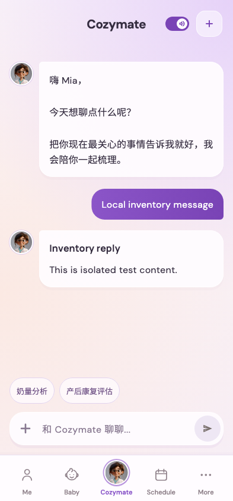

# 嗨 Mia，  /  / 今天想聊点什么呢？  /  / 把你现在最关心的事情告诉我就好，我会陪你一起梳理。

稳定状态 ID：`05-agent/agent-journey-reply`

- 状态：`agent-journey-reply`
- 范围：viewport
- 数据：组件测试的合成数据，不代表生产账户业务状态。
- 实际执行：`inventory agent real reply message copy and tab retention`
- 测试来源：[test/features/agent_hub/agent_inventory_journey_test.dart:217](../../../../test/features/agent_hub/agent_inventory_journey_test.dart)
- [运行元数据、点击轨迹与滚动范围](../../raw/test/goldens/ui_inventory/agent-journey-reply-393.png.json)
- 正常路由链：**已在实际 App 路由中执行**；Authenticated More → tap Cozymate bottom navigation。
- 当前路由：`/`
- 触发：SSE completion → final Markdown response
- 证据边界：Actual MomCozyFlutterApp/createMomCozyRouter/AgentHubPage via public agentHubBuilder; production SSE parser, runner with default retries, cancel client and profile repository; isolated SSE/control HTTP/voice dependencies. History disabled as in default local build; no remote model request.

业务写操作均只请求测试传输层；不表示生产账号的数据被修改，也不代表外部服务交易已验收。

前一个已截图状态之后实际发生的指针操作（文字仅为起点附近的几何匹配，可能包含遮挡背景，不等于命中控件；实际目标以测试定位、断言和上述触发说明为准）：

- 此观察点前没有指针操作记录；可能为直接挂载、异步状态变化或输入事件，需结合测试源码核实。

## 其它尺寸与字号

- [agent-journey-reply-393.png](../../raw/test/goldens/ui_inventory/agent-journey-reply-393.png) · 393 × 844
