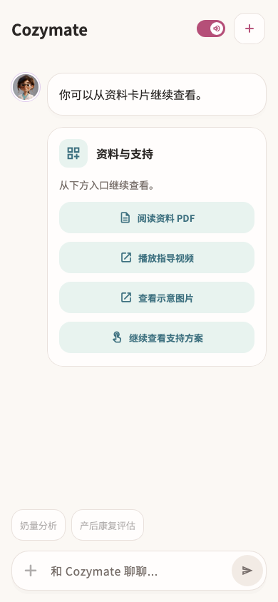

# 你可以从资料卡片继续查看。

稳定状态 ID：`05-agent/agent-resource-actions`

- 状态：`agent-resource-actions`
- 范围：viewport
- 数据：组件测试的合成数据，不代表生产账户业务状态。
- 实际执行：`resource card reading and original actions 390.0/1.0`
- 测试来源：[test/features/agent_hub/agent_resource_card_design_test.dart:104](../../../../test/features/agent_hub/agent_resource_card_design_test.dart)
- [运行元数据、点击轨迹与滚动范围](../../raw/test/goldens/design_system/agent-resource-actions-390-1x.png.json)
- 正常用户入口：**待逐项核实**；下方是当前组件与既有映射推导的候选入口，不视为已遍历。

候选入口：`/`

前一个已截图状态之后实际发生的指针操作（文字仅为起点附近的几何匹配，可能包含遮挡背景，不等于命中控件；实际目标以测试定位、断言和上述触发说明为准）：

- tap：阅读资料 PDF
- tap：播放指导视频
- tap：查看示意图片
- tap：继续查看支持方案

## 其它尺寸与字号

- [agent-resource-actions-390-1x.png](../../raw/test/goldens/design_system/agent-resource-actions-390-1x.png) · 390 × 844
