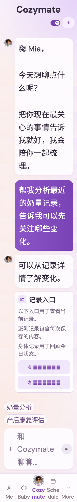

# 可以从记录详情了解变化。

稳定状态 ID：`05-agent/agent-workflow-journey-latest-returned`

- 状态：`agent-workflow-journey-latest-returned`
- 范围：full-measured-scroll-stitch
- 数据：组件测试的合成数据，不代表生产账户业务状态。
- 实际执行：`inventory workflow milk shortcut artifact routes and latest button`
- 测试来源：[test/features/agent_hub/agent_workflow_inventory_journey_test.dart:225](../../../../test/features/agent_hub/agent_workflow_inventory_journey_test.dart)
- [运行元数据、点击轨迹与滚动范围](../../raw/test/goldens/ui_inventory/agent-workflow-journey-latest-returned-320-2x.png.json)
- 正常路由链：**已在实际 App 路由中执行**；Authenticated More → tap Cozymate bottom navigation。
- 当前路由：`/`
- 触发：Tap latest-message button → scroll to newest response
- 证据边界：Actual MomCozyFlutterApp/createMomCozyRouter/AgentHubPage via public agentHubBuilder; production SSE parser, runner with default retries, cancel client and profile repository; isolated SSE/control/ticket HTTP and voice dependencies; production action client and support ticket repository. History disabled as in default local build; no remote model request.

业务写操作均只请求测试传输层；不表示生产账号的数据被修改，也不代表外部服务交易已验收。

前一个已截图状态之后实际发生的指针操作（文字仅为起点附近的几何匹配，可能包含遮挡背景，不等于命中控件；实际目标以测试定位、断言和上述触发说明为准）：

- tap：帮我分析最近的奶量记录，告诉我可以先关注哪些变化。 / 回到最新消息

## 其它尺寸与字号

- [agent-workflow-journey-latest-returned-320-2x.png](../../raw/test/goldens/ui_inventory/agent-workflow-journey-latest-returned-320-2x.png) · 320 × 844
