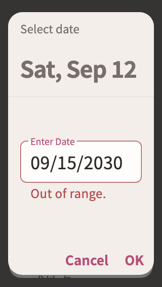

# 日程

稳定状态 ID：`06-schedule/schedule-date-range-error-320-2x-short`

- 状态：`schedule-date-range-error-320-2x-short`
- 范围：viewport
- 数据：组件测试的合成数据，不代表生产账户业务状态。
- 实际执行：`large editor date and time validation retain draft and accepted values`
- 测试来源：[test/modules/schedule/personal_schedule_editor_test.dart:451](../../../../test/modules/schedule/personal_schedule_editor_test.dart)
- [运行元数据、点击轨迹与滚动范围](../../raw/test/goldens/design_system/schedule-date-range-error-320-2x-short.png.json)
- 正常用户入口：**待逐项核实**；下方是当前组件与既有映射推导的候选入口，不视为已遍历。

候选入口：`/schedule`

前一个已截图状态之后实际发生的指针操作（文字仅为起点附近的几何匹配，可能包含遮挡背景，不等于命中控件；实际目标以测试定位、断言和上述触发说明为准）：

- tap：你添加的日程、IBCLC 咨询和服务任务会显示在这里。
- tap：查看每天的日程安排 / 四 / 2026-09-12
- tap：27 / 需要准备的东西或地点 / OK

## 其它尺寸与字号

- [schedule-date-range-error-320-2x-short.png](../../raw/test/goldens/design_system/schedule-date-range-error-320-2x-short.png) · 320 × 568
