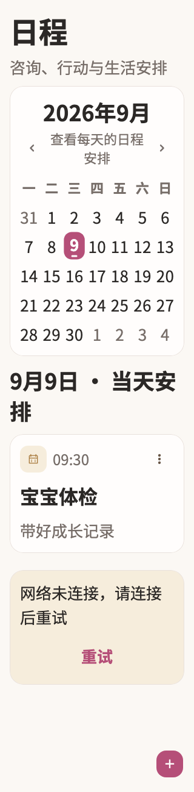

# 09:30

稳定状态 ID：`06-schedule/schedule-short-refresh-error`

- 状态：`schedule-short-refresh-error`
- 范围：full-measured-scroll-stitch
- 数据：组件测试的合成数据，不代表生产账户业务状态。
- 实际执行：`short large initial load error retries and cached refresh retains agenda`
- 测试来源：[test/modules/schedule/schedule_page_golden_test.dart:624](../../../../test/modules/schedule/schedule_page_golden_test.dart)
- [运行元数据、点击轨迹与滚动范围](../../raw/test/goldens/design_system/schedule-short-refresh-error.png.json)
- 正常用户入口：**待逐项核实**；下方是当前组件与既有映射推导的候选入口，不视为已遍历。

候选入口：`/schedule`

前一个已截图状态之后实际发生的指针操作（文字仅为起点附近的几何匹配，可能包含遮挡背景，不等于命中控件；实际目标以测试定位、断言和上述触发说明为准）：

- tap：重试
- drag：查看每天的日程安排
- drag：24

## 其它尺寸与字号

- [schedule-short-refresh-error.png](../../raw/test/goldens/design_system/schedule-short-refresh-error.png) · 320 × 568
