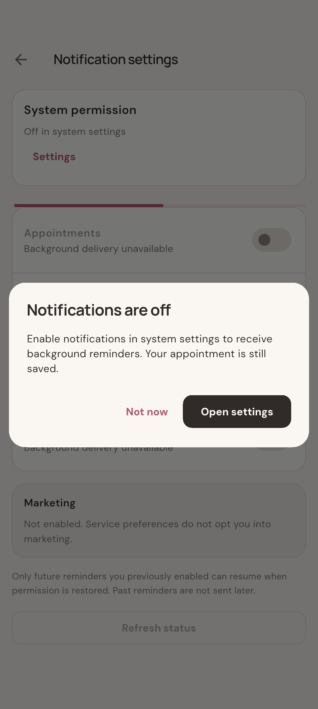

# 通知拒绝后的设置引导（拒绝恢复链）

- 入口：`/notifications/settings`
- 触发：Enable after denial → offer Android settings
- 数据：通知 API、推送 Gateway、账号及安装存储使用隔离数据；Android 系统权限与权限插件真实运行，不表示云推送投递成功。
- 验证范围：实际 Android App：More → 通知 → 设置 → 分类开关 → App 说明 → 系统申请。系统按钮由 UIAutomator 当前节点定位并实际点击；App 返回状态断言使用真实 NativeNotificationPlatform。
- 测试：`integration_test/notification_native_permission_test.dart`
- [原生截图元数据](../../native/permission-manifest.json)
- [当前交互窗口](../../native/notification-permission/native-permission-deny-settings-offer.png)
- 起点：More → notifications → notification settings → category switch → actual native permission
- [前一个状态](../../07-me/native-permission-deny-denied/README.md)
