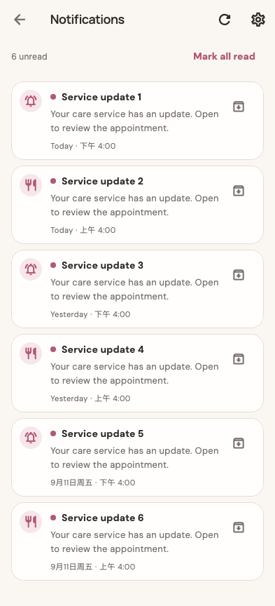

# 6 unread

稳定状态 ID：`07-me/notification-journey-inbox-archived`

- 状态：`notification-journey-inbox-archived`
- 范围：full-measured-scroll-stitch
- 数据：组件测试的合成数据，不代表生产账户业务状态。
- 实际执行：`inventory notification inbox empty loading paging and archive`
- 测试来源：[test/features/notifications/notification_inventory_journey_test.dart:178](../../../../test/features/notifications/notification_inventory_journey_test.dart)
- [运行元数据、点击轨迹与滚动范围](../../raw/test/goldens/ui_inventory/notification-journey-inbox-archived-393.png.json)
- 正常路由链：**已在实际 App 路由中执行**；Authenticated More page。
- 当前路由：`/notifications`
- 触发：Archive last update → removed immediately, unread count refreshed
- 证据边界：Actual MomCozyFlutterApp/createMomCozyRouter, production notification coordinator/repository/controller; isolated HTTP, push gateway and permission platform; real router.go and ScaffoldMessenger callbacks, no native OS dialog or remote push

业务写操作均只请求测试传输层；不表示生产账号的数据被修改，也不代表外部服务交易已验收。

前一个已截图状态之后实际发生的指针操作（文字仅为起点附近的几何匹配，可能包含遮挡背景，不等于命中控件；实际目标以测试定位、断言和上述触发说明为准）：

- tap：坐标 [341.0, 732.0] → [341.0, 732.0]

## 其它尺寸与字号

- [notification-journey-inbox-archived-393.png](../../raw/test/goldens/ui_inventory/notification-journey-inbox-archived-393.png) · 393 × 844
