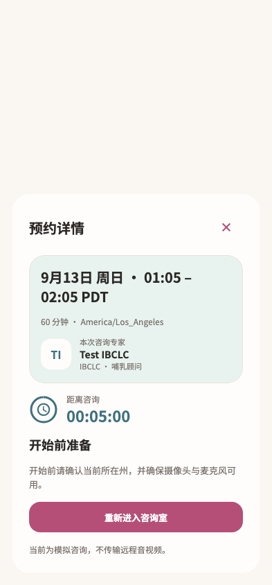

# 预约详情

稳定状态 ID：`08-expert-service/consultation-journey-current-live-reentry-preparation`

- 状态：`consultation-journey-current-live-reentry-preparation`
- 范围：viewport
- 数据：组件测试的合成数据，不代表生产账户业务状态。
- 实际执行：`inventory consultation current live leave route`
- 测试来源：[test/modules/consultation/consultation_inventory_journey_test.dart:151](../../../../test/modules/consultation/consultation_inventory_journey_test.dart)
- [运行元数据、点击轨迹与滚动范围](../../raw/test/goldens/ui_inventory/consultation-journey-current-live-reentry-preparation-393.png.json)
- 正常路由链：**已在实际 App 路由中执行**；Authenticated More → tap Me bottom navigation。
- 当前路由：`/services/appointments/service-appointment/room`
- 触发：Booking → return to consultation → preparation offers re-entry
- 证据边界：Actual MomCozyFlutterApp/createMomCozyRouter, production repositories/codecs and LiveKit device checks; isolated HTTP and native method channels, sandbox room, fixed clock/timezone; no real OS permission dialog or remote media

业务写操作均只请求测试传输层；不表示生产账号的数据被修改，也不代表外部服务交易已验收。

前一个已截图状态之后实际发生的指针操作（文字仅为起点附近的几何匹配，可能包含遮挡背景，不等于命中控件；实际目标以测试定位、断言和上述触发说明为准）：

- tap：返回咨询室

## 其它尺寸与字号

- [consultation-journey-current-live-reentry-preparation-393.png](../../raw/test/goldens/ui_inventory/consultation-journey-current-live-reentry-preparation-393.png) · 393 × 844
