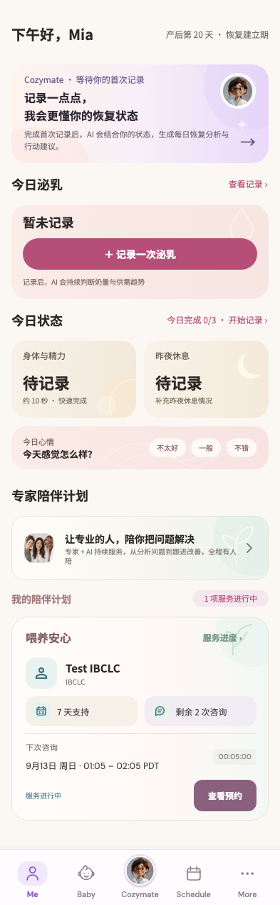

# 今日状态

稳定状态 ID：`08-expert-service/home-consultation-journey-load-return-home`

- 状态：`home-consultation-journey-load-return-home`
- 范围：full-measured-scroll-stitch
- 数据：组件测试的合成数据，不代表生产账户业务状态。
- 实际执行：`inventory home consultation load failure retry`
- 测试来源：[test/modules/consultation/home_consultation_inventory_journey_test.dart:157](../../../../test/modules/consultation/home_consultation_inventory_journey_test.dart)
- [运行元数据、点击轨迹与滚动范围](../../raw/test/goldens/ui_inventory/home-consultation-journey-load-return-home-393.png.json)
- 正常路由链：**已在实际 App 路由中执行**；Authenticated More → tap Me bottom navigation。
- 当前路由：`/me`
- 触发：Close recovered modal → same home scroll position
- 证据边界：Actual MomCozyFlutterApp/createMomCozyRouter, production repositories/codecs and LiveKit device checks; isolated HTTP and native method channels, sandbox room, fixed clock/timezone; no real OS permission dialog or remote media

业务写操作均只请求测试传输层；不表示生产账号的数据被修改，也不代表外部服务交易已验收。

前一个已截图状态之后实际发生的指针操作（文字仅为起点附近的几何匹配，可能包含遮挡背景，不等于命中控件；实际目标以测试定位、断言和上述触发说明为准）：

- tap：专家陪伴计划

## 其它尺寸与字号

- [home-consultation-journey-load-return-home-393.png](../../raw/test/goldens/ui_inventory/home-consultation-journey-load-return-home-393.png) · 393 × 844
