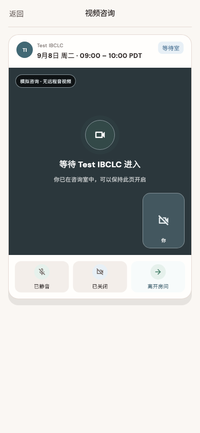

# 喂养安心

稳定状态 ID：`08-expert-service/home-preparation-room`

- 状态：`home-preparation-room`
- 范围：viewport
- 数据：组件测试的合成数据，不代表生产账户业务状态。
- 实际执行：`home preparation closes, cancels and enters through existing checks 390.0/1.0`
- 测试来源：[test/modules/consultation/home_consultation_dialog_test.dart:206](../../../../test/modules/consultation/home_consultation_dialog_test.dart)
- [运行元数据、点击轨迹与滚动范围](../../raw/test/goldens/design_system/home-preparation-room-390.png.json)
- 正常用户入口：**待逐项核实**；下方是当前组件与既有映射推导的候选入口，不视为已遍历。

候选入口：`/services/appointments/:appointmentId/room`

前一个已截图状态之后实际发生的指针操作（文字仅为起点附近的几何匹配，可能包含遮挡背景，不等于命中控件；实际目标以测试定位、断言和上述触发说明为准）：

- tap：保留预约
- tap：查看预约
- tap：开始咨询
- tap：继续确认
- tap：确认并进入咨询室

## 其它尺寸与字号

- [home-preparation-room-320-2x.png](../../raw/test/goldens/design_system/home-preparation-room-320-2x.png) · 320 × 844
- [home-preparation-room-320.png](../../raw/test/goldens/design_system/home-preparation-room-320.png) · 320 × 844
- [home-preparation-room-390-2x.png](../../raw/test/goldens/design_system/home-preparation-room-390-2x.png) · 390 × 844
- [home-preparation-room-390.png](../../raw/test/goldens/design_system/home-preparation-room-390.png) · 390 × 844
- [home-preparation-room-430-2x.png](../../raw/test/goldens/design_system/home-preparation-room-430-2x.png) · 430 × 844
- [home-preparation-room-430.png](../../raw/test/goldens/design_system/home-preparation-room-430.png) · 430 × 844
