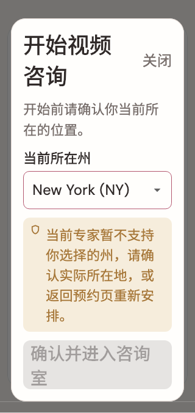

# 预约详情

稳定状态 ID：`08-expert-service/preflight-short-blocked-footer`

- 状态：`preflight-short-blocked-footer`
- 范围：full-measured-scroll-stitch
- 数据：组件测试的合成数据，不代表生产账户业务状态。
- 实际执行：`short screen enlarged text keeps consent and region reachable`
- 测试来源：[test/modules/consultation/consultation_start_test.dart:152](../../../../test/modules/consultation/consultation_start_test.dart)
- [运行元数据、点击轨迹与滚动范围](../../raw/test/goldens/design_system/preflight-short-blocked-footer-320-2x.png.json)
- 正常用户入口：**待逐项核实**；下方是当前组件与既有映射推导的候选入口，不视为已遍历。

候选入口：`/services/appointments/:appointmentId/room`

前一个已截图状态之后实际发生的指针操作（文字仅为起点附近的几何匹配，可能包含遮挡背景，不等于命中控件；实际目标以测试定位、断言和上述触发说明为准）：

- tap：开始咨询
- tap：当前为模拟咨询，不传输远程音视频。 / 继续确认
- tap：请稍候… / 去授权
- tap：请稍候… / 我同意开启本次服务的视频咨询
- tap：当前为模拟咨询，不传输远程音视频。 / 确认并进入咨询室 / 确认视频授权
- tap：请稍候… / California (CA)
- tap：请稍候… / 当前为模拟咨询，不传输远程音视频。 / 确认并进入咨询室 / New York (NY)
- tap：当前为模拟咨询，不传输远程音视频。 / 确认并进入咨询室

## 其它尺寸与字号

- [preflight-short-blocked-footer-320-2x.png](../../raw/test/goldens/design_system/preflight-short-blocked-footer-320-2x.png) · 320 × 568
