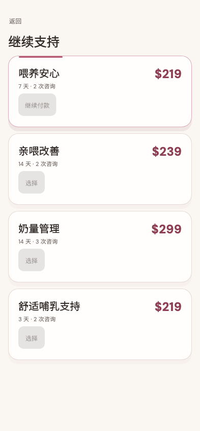

# 继续支持

稳定状态 ID：`08-expert-service/renew-journey-order-loading`

- 状态：`renew-journey-order-loading`
- 范围：viewport
- 数据：组件测试的合成数据，不代表生产账户业务状态。
- 实际执行：`inventory completed service pending order read and cancel 393.0`
- 测试来源：[test/modules/services/renew_inventory_journey_test.dart:176](../../../../test/modules/services/renew_inventory_journey_test.dart)
- [运行元数据、点击轨迹与滚动范围](../../raw/test/goldens/ui_inventory/renew-journey-order-loading-393.png.json)
- 正常路由链：**已在实际 App 路由中执行**；Authenticated More → tap Me bottom navigation。
- 当前路由：`/services/episodes/completed-episode/renew`
- 触发：Continue payment → order read pending, package buttons disabled
- 证据边界：Actual MomCozyFlutterApp/createMomCozyRouter, production home/timeline/renew/purchase pages and repositories; isolated HTTP with completed original service preserved independently; fixed clock and timezone, no remote order/payment

业务写操作均只请求测试传输层；不表示生产账号的数据被修改，也不代表外部服务交易已验收。

前一个已截图状态之后实际发生的指针操作（文字仅为起点附近的几何匹配，可能包含遮挡背景，不等于命中控件；实际目标以测试定位、断言和上述触发说明为准）：

- tap：继续付款

## 其它尺寸与字号

- [renew-journey-order-loading-320-2x.png](../../raw/test/goldens/ui_inventory/renew-journey-order-loading-320-2x.png) · 320 × 844
- [renew-journey-order-loading-393.png](../../raw/test/goldens/ui_inventory/renew-journey-order-loading-393.png) · 393 × 844
