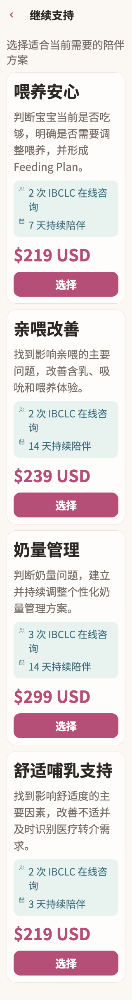

# 舒适哺乳支持

稳定状态 ID：`08-expert-service/renew-short-last-package`

- 状态：`renew-short-last-package`
- 范围：full-measured-scroll-stitch
- 数据：组件测试的合成数据，不代表生产账户业务状态。
- 实际执行：`short large catalog loads, scrolls and returns without ordering`
- 测试来源：[test/modules/services/service_renew_test.dart:213](../../../../test/modules/services/service_renew_test.dart)
- [运行元数据、点击轨迹与滚动范围](../../raw/test/goldens/design_system/renew-short-last-package-320-2x.png.json)
- 正常用户入口：**待逐项核实**；下方是当前组件与既有映射推导的候选入口，不视为已遍历。

候选入口：`/services/renew /services/episodes/:episodeId/renew`

前一个已截图状态之后实际发生的指针操作（文字仅为起点附近的几何匹配，可能包含遮挡背景，不等于命中控件；实际目标以测试定位、断言和上述触发说明为准）：

- drag：判断宝宝当前是否吃够，明确是否需要调整喂养，并形成 Feeding Plan。
- drag：$219 USD
- drag：找到影响亲喂的主要问题，改善含乳、吸吮和喂养体验。
- drag：选择
- drag：3 次 IBCLC 在线咨询

## 其它尺寸与字号

- [renew-short-last-package-320-2x.png](../../raw/test/goldens/design_system/renew-short-last-package-320-2x.png) · 320 × 568
