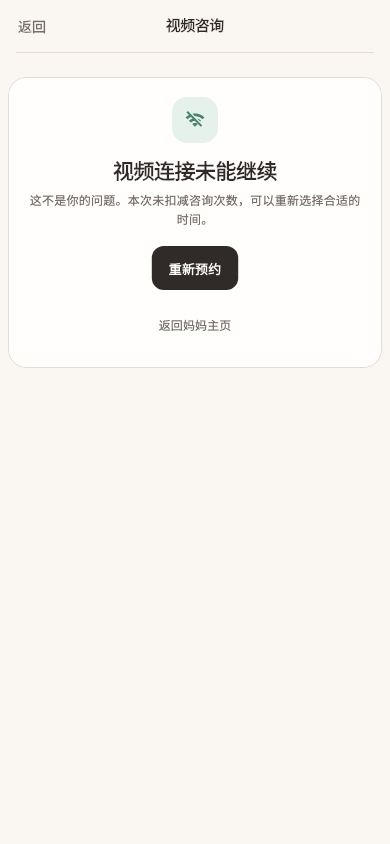

# 视频连接未能继续

稳定状态 ID：`08-expert-service/room-technical-failure`

- 状态：`room-technical-failure`
- 范围：viewport
- 数据：组件测试的合成数据，不代表生产账户业务状态。
- 实际执行：`unsuccessful room outcomes 390.0 / 1.0`
- 测试来源：[test/modules/consultation/room_outcome_design_test.dart:17](../../../../test/modules/consultation/room_outcome_design_test.dart)
- [运行元数据、点击轨迹与滚动范围](../../raw/test/goldens/product_baseline/room-technical-failure-390-1x.png.json)
- 正常用户入口：**待逐项核实**；下方是当前组件与既有映射推导的候选入口，不视为已遍历。

候选入口：`/services/appointments/:appointmentId/room`

前一个已截图状态之后实际发生的指针操作（文字仅为起点附近的几何匹配，可能包含遮挡背景，不等于命中控件；实际目标以测试定位、断言和上述触发说明为准）：

- tap：重新预约
- tap：返回妈妈主页

## 其它尺寸与字号

- [room-technical-failure-320-1x.png](../../raw/test/goldens/product_baseline/room-technical-failure-320-1x.png) · 320 × 844
- [room-technical-failure-320-2x.png](../../raw/test/goldens/product_baseline/room-technical-failure-320-2x.png) · 320 × 844
- [room-technical-failure-390-1x.png](../../raw/test/goldens/product_baseline/room-technical-failure-390-1x.png) · 390 × 844
- [room-technical-failure-390-2x.png](../../raw/test/goldens/product_baseline/room-technical-failure-390-2x.png) · 390 × 844
- [room-technical-failure-430-1x.png](../../raw/test/goldens/product_baseline/room-technical-failure-430-1x.png) · 430 × 844
- [room-technical-failure-430-2x.png](../../raw/test/goldens/product_baseline/room-technical-failure-430-2x.png) · 430 × 844
