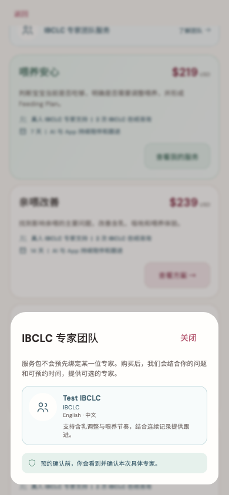

# IBCLC 专家团队服务

稳定状态 ID：`08-expert-service/service-team-populated`

- 状态：`service-team-populated`
- 范围：viewport
- 数据：组件测试的合成数据，不代表生产账户业务状态。
- 实际执行：`catalog owned and pending actions at 390.0 / 1.0`
- 测试来源：[test/modules/services/service_design_test.dart:289](../../../../test/modules/services/service_design_test.dart)
- [运行元数据、点击轨迹与滚动范围](../../raw/test/goldens/design_system/service-team-populated-390.png.json)
- 正常用户入口：**待逐项核实**；下方是当前组件与既有映射推导的候选入口，不视为已遍历。

候选入口：`/services`、`/services/:packageId`

前一个已截图状态之后实际发生的指针操作（文字仅为起点附近的几何匹配，可能包含遮挡背景，不等于命中控件；实际目标以测试定位、断言和上述触发说明为准）：

- drag：奶量管理 / 判断奶量问题，建立并持续调整个性化奶量管理方案。
- tap：了解团队

## 其它尺寸与字号

- [service-team-populated-320.png](../../raw/test/goldens/design_system/service-team-populated-320.png) · 320 × 844
- [service-team-populated-390.png](../../raw/test/goldens/design_system/service-team-populated-390.png) · 390 × 844
- [service-team-populated-430.png](../../raw/test/goldens/design_system/service-team-populated-430.png) · 430 × 844
