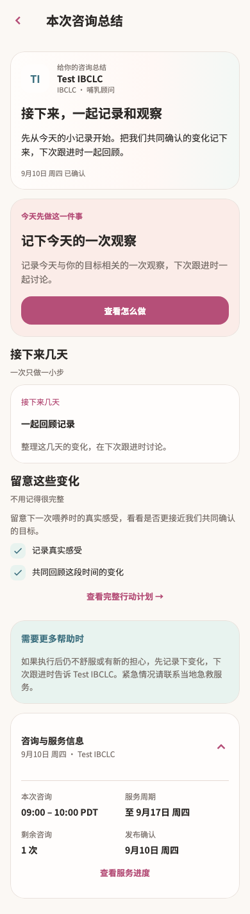

# TI

稳定状态 ID：`08-expert-service/summary-metadata`

- 状态：`summary-metadata`
- 范围：full-measured-scroll-stitch
- 数据：组件测试的合成数据，不代表生产账户业务状态。
- 实际执行：`summary content task and destinations 390.0 / 1.0`
- 测试来源：[test/modules/services/consultation_summary_test.dart:105](../../../../test/modules/services/consultation_summary_test.dart)
- [运行元数据、点击轨迹与滚动范围](../../raw/test/goldens/design_system/summary-metadata-390.png.json)
- 正常用户入口：**待逐项核实**；下方是当前组件与既有映射推导的候选入口，不视为已遍历。

候选入口：`/services/appointments/:appointmentId/summary`

前一个已截图状态之后实际发生的指针操作（文字仅为起点附近的几何匹配，可能包含遮挡背景，不等于命中控件；实际目标以测试定位、断言和上述触发说明为准）：

- tap：共同回顾这段时间的变化
- tap：一起回顾记录
- tap：坐标 [324.0, 523.0] → [324.0, 523.0]
- tap：查看完整行动计划 →
- tap：咨询与服务信息 / 9月10日 周四 · Test IBCLC

## 其它尺寸与字号

- [summary-metadata-320-2x.png](../../raw/test/goldens/design_system/summary-metadata-320-2x.png) · 320 × 844
- [summary-metadata-320.png](../../raw/test/goldens/design_system/summary-metadata-320.png) · 320 × 844
- [summary-metadata-390.png](../../raw/test/goldens/design_system/summary-metadata-390.png) · 390 × 844
- [summary-metadata-430.png](../../raw/test/goldens/design_system/summary-metadata-430.png) · 430 × 844
