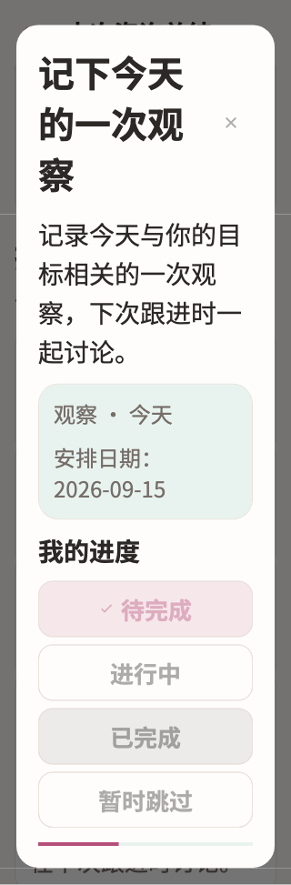

# TI

稳定状态 ID：`08-expert-service/summary-short-updating-320-2x-short`

- 状态：`summary-short-updating-320-2x-short`
- 范围：full-measured-scroll-stitch
- 数据：组件测试的合成数据，不代表生产账户业务状态。
- 实际执行：`short large task keeps pending updates locked and retryable`
- 测试来源：[test/modules/services/consultation_summary_test.dart:105](../../../../test/modules/services/consultation_summary_test.dart)
- [运行元数据、点击轨迹与滚动范围](../../raw/test/goldens/design_system/summary-short-updating-320-2x-short.png.json)
- 正常用户入口：**待逐项核实**；下方是当前组件与既有映射推导的候选入口，不视为已遍历。

候选入口：`/services/appointments/:appointmentId/summary`

前一个已截图状态之后实际发生的指针操作（文字仅为起点附近的几何匹配，可能包含遮挡背景，不等于命中控件；实际目标以测试定位、断言和上述触发说明为准）：

- tap：整理这几天的变化，在下次跟进时讨论。 / 已完成

## 其它尺寸与字号

- [summary-short-updating-320-2x-short.png](../../raw/test/goldens/design_system/summary-short-updating-320-2x-short.png) · 320 × 568
