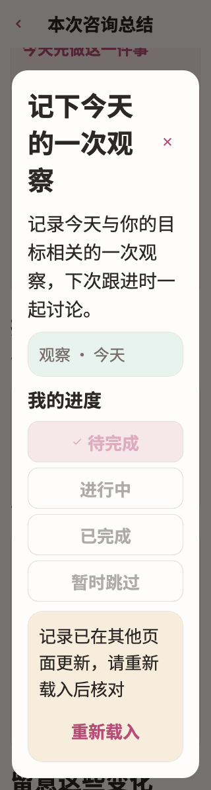

# TI

稳定状态 ID：`08-expert-service/summary-superseded`

- 状态：`summary-superseded`
- 范围：full-measured-scroll-stitch
- 数据：组件测试的合成数据，不代表生产账户业务状态。
- 实际执行：`superseded action removed by reload remains safely closable at large text`
- 测试来源：[test/modules/services/consultation_summary_test.dart:105](../../../../test/modules/services/consultation_summary_test.dart)
- [运行元数据、点击轨迹与滚动范围](../../raw/test/goldens/design_system/summary-superseded-320-2x.png.json)
- 正常用户入口：**待逐项核实**；下方是当前组件与既有映射推导的候选入口，不视为已遍历。

候选入口：`/services/appointments/:appointmentId/summary`

前一个已截图状态之后实际发生的指针操作（文字仅为起点附近的几何匹配，可能包含遮挡背景，不等于命中控件；实际目标以测试定位、断言和上述触发说明为准）：

- tap：查看怎么做
- tap：留意下一次喂养时的真实感受，看看是否更接近我们共同确认的目标。 / 已完成

## 其它尺寸与字号

- [summary-superseded-320-2x.png](../../raw/test/goldens/design_system/summary-superseded-320-2x.png) · 320 × 844
