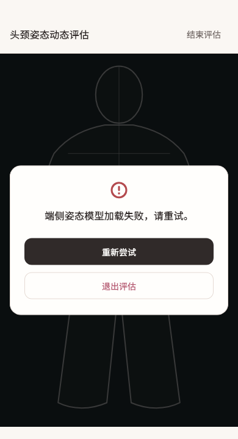

# 头颈姿态动态评估

稳定状态 ID：`09-motion/motion-failure`

- 状态：`motion-failure`
- 范围：viewport
- 数据：组件测试的合成数据，不代表生产账户业务状态。
- 实际执行：`motion responsive failure retry and exit 390.0 / 1.0`
- 测试来源：[test/features/motion_assessment/presentation/motion_assessment_controller_test.dart:1618](../../../../test/features/motion_assessment/presentation/motion_assessment_controller_test.dart)
- [运行元数据、点击轨迹与滚动范围](../../raw/test/goldens/design_system/motion-failure-390.png.json)
- 正常用户入口：**待逐项核实**；下方是当前组件与既有映射推导的候选入口，不视为已遍历。

候选入口：尚无路由对应；可能是内联组件/全局状态。

前一个已截图状态之后实际发生的指针操作（文字仅为起点附近的几何匹配，可能包含遮挡背景，不等于命中控件；实际目标以测试定位、断言和上述触发说明为准）：

- 此观察点前没有指针操作记录；可能为直接挂载、异步状态变化或输入事件，需结合测试源码核实。

## 其它尺寸与字号

- [motion-failure-320-2x.png](../../raw/test/goldens/design_system/motion-failure-320-2x.png) · 320 × 320
- [motion-failure-320.png](../../raw/test/goldens/design_system/motion-failure-320.png) · 320 × 720
- [motion-failure-390-2x.png](../../raw/test/goldens/design_system/motion-failure-390-2x.png) · 390 × 320
- [motion-failure-390.png](../../raw/test/goldens/design_system/motion-failure-390.png) · 390 × 720
- [motion-failure-430-2x.png](../../raw/test/goldens/design_system/motion-failure-430-2x.png) · 430 × 320
- [motion-failure-430.png](../../raw/test/goldens/design_system/motion-failure-430.png) · 430 × 720
