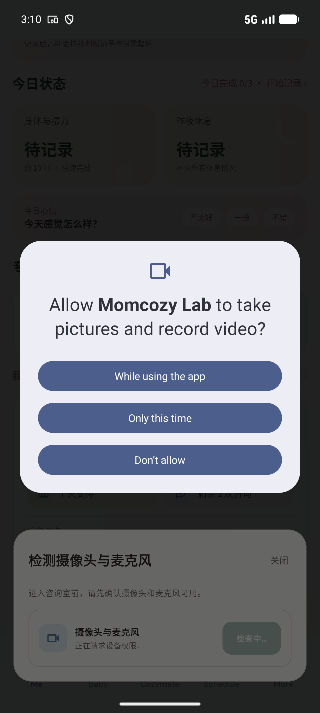

# Android 再次申请摄像头（允许）

- 入口：`/me`
- 触发：Actual Android camera permission → choose allow
- 数据：HTTP、账号会话为隔离测试数据；系统权限及本地设备轨道真实运行，没有加入远端房间或提交业务数据。
- 验证范围：实际 App More → Me → 查看预约 → 开始咨询；实际点击 Android 摄像头/麦克风拒绝与允许按钮，生产 LiveKit 本地音视频轨道检测；回到 App 断言失败、成功、再次检查、咨询确认及返回。
- 测试：`integration_test/consultation_native_device_test.dart`
- [原生截图元数据](../../native/device-manifest.json)
- [当前交互窗口](../../native/consultation-devices/native-device-allow-camera.png)
- [实际系统 UI 层级](../../native/consultation-devices/native-device-allow-camera.xml)
- 起点：More → Me → View appointment → Start consultation → actual native device permission
- [前一个状态](../../03-mom/native-device-retry-checking/README.md)
