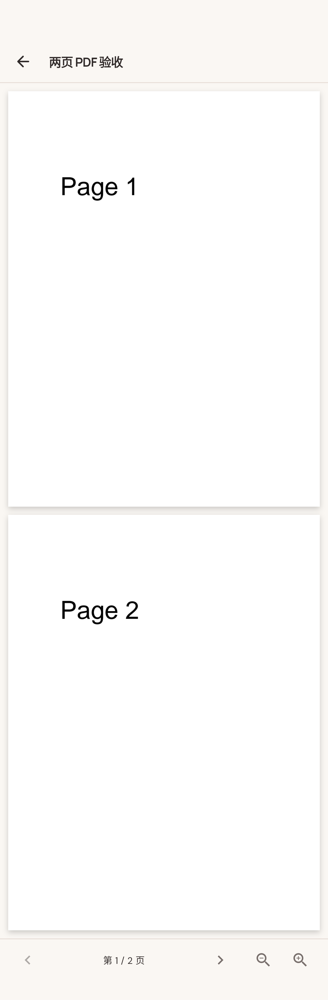

# PDF 已载入第一页

- 入口：`/media-viewer`
- 触发：实际 /media-viewer 路由，注入两页 PDF 资产
- 数据：本地合成数据与媒体资产；实际原生渲染。
- 验证范围：registered route exercised; external Agent origin still requires linkage audit
- 测试：`integration_test/media_viewer_pdf_test.dart`
- [原生截图元数据](../../native/media-manifest.json)
- [当前交互窗口](../../native/native-media-pdf-page-1.png)

默认图由实际纵向滚动拼接，页头与固定底部各保留一次；当前交互窗口单独保留。PDF 放大后保留当前横向视窗，完整页宽请查看适配宽度的 PDF 第一页长图。[测量数据](../../native/native-media-pdf-full-document.json)。
