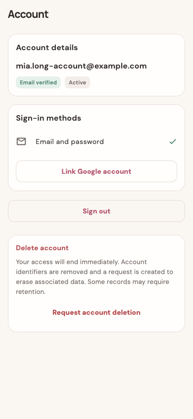
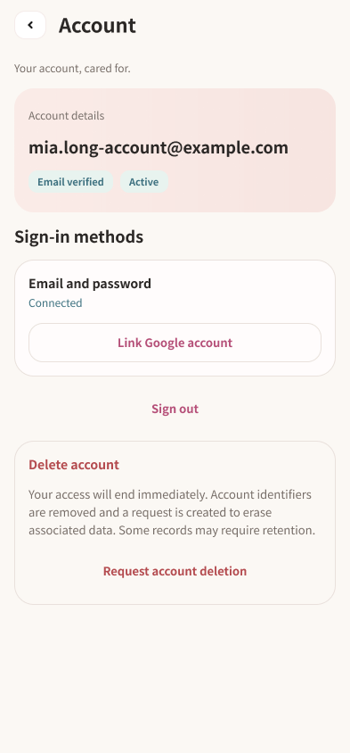
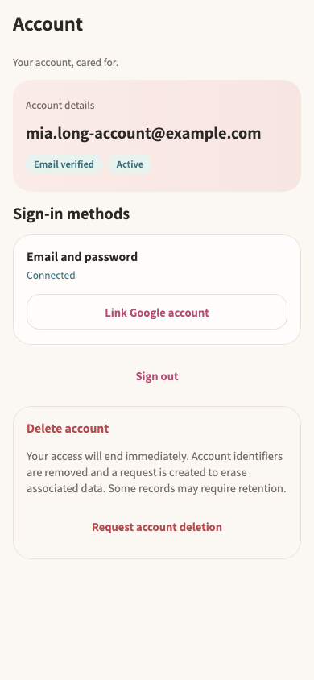

# 账号页重构交付 · 2026-09-14

`/account` 已按现有截图完成 Figma 设计和 Flutter 实现。身份、登录方式、账号操作形成明确层级；密码确认、删除确认、加载、失败和忙碌状态一起迁移。整套 App 的增量任务仍在继续。

## 设计与状态

| 内容 | Figma |
| --- | --- |
| 默认账号页 | [128:68](https://www.figma.com/design/ePIoJkiMiXiug9ibpcgRbl?node-id=128-68) |
| 加载 / 加载失败 | [128:98](https://www.figma.com/design/ePIoJkiMiXiug9ibpcgRbl?node-id=128-98) / [128:132](https://www.figma.com/design/ePIoJkiMiXiug9ibpcgRbl?node-id=128-132) |
| 密码确认 / 输入中 | [130:68](https://www.figma.com/design/ePIoJkiMiXiug9ibpcgRbl?node-id=130-68) / [128:149](https://www.figma.com/design/ePIoJkiMiXiug9ibpcgRbl?node-id=128-149) |
| 键盘与两倍字号 | [130:109](https://www.figma.com/design/ePIoJkiMiXiug9ibpcgRbl?node-id=130-109) |
| 删除确认 | [128:189](https://www.figma.com/design/ePIoJkiMiXiug9ibpcgRbl?node-id=128-189) |
| 绑定成功 / Google 不可用 | [128:227](https://www.figma.com/design/ePIoJkiMiXiug9ibpcgRbl?node-id=128-227) / [132:68](https://www.figma.com/design/ePIoJkiMiXiug9ibpcgRbl?node-id=132-68) |
| 操作失败 / 等待 | [128:262](https://www.figma.com/design/ePIoJkiMiXiug9ibpcgRbl?node-id=128-262) / [128:359](https://www.figma.com/design/ePIoJkiMiXiug9ibpcgRbl?node-id=128-359) |
| 无登录方式、禁用账号 / 长账号与待删除状态 | [128:294](https://www.figma.com/design/ePIoJkiMiXiug9ibpcgRbl?node-id=128-294) / [128:329](https://www.figma.com/design/ePIoJkiMiXiug9ibpcgRbl?node-id=128-329) |

13 个状态画板都位于妈妈页的同一文件，交付说明节点为 `132:100`。本轮从现有 `07-me/account*` 截图开始，读取妈妈页和 More 的现有基础后在 Figma 设计，再通过 `get_design_context` 进入 Flutter 实现。

| 原截图 | Figma | Flutter |
| --- | --- | --- |
|  |  |  |

账号身份使用妈妈页柔粉渐变，登录方式独立分组；删除文案保持完整，操作维持低优先级，进入确认弹窗后才提供明确的破坏性主按钮。账号页已有英文内容继续使用英文，没有改变数据含义或确认文案。

## 实现与复用

- `account_page.dart` 复用 `MomHomeSurface` 和 `MomHomeTokens`，保留读取、重试、Google 绑定、退出与删除流程。长邮箱完整换行，状态标签可换行，整页可滚动。
- `mom_settings_theme.dart` 为已迁移设置页面提供局部主题，统一按钮、输入框、弹窗和进度条；未修改全局主题。
- `MomHomeTokens.neutralSurface` 对应 Figma 新增原始变量 `131:68` 与语义变量 `131:69`。危险操作使用项目既有 `MomCozyColors.danger`。
- 返回按钮复用 `assets/images/me_baby_overview/icons/back-button.svg`，图形 36×32、触控目标至少 48。没有新制图片或图标。
- 弹窗保留 Flutter 原生滚动、焦点和键盘避让。两倍字号时确认与取消仍可操作。页面主体增加显式裁切，修复滚动和弹窗切换后内容绘制到标题栏区域的问题。

确认之后执行的 Google 绑定与删除业务代码，及 `_logout`、`_run`，与本轮开始时逐段比较保持一致。测试还验证了密码参数、确认前无删除请求、失败后的入口恢复和退出清除会话。

## 验证

最终静态分析 4 个文件无问题；联合回归 **78 项全部通过**：

```sh
flutter test --no-pub \
  test/features/auth/auth_design_test.dart \
  test/features/auth/account_page_test.dart \
  test/features/auth/account_redesign_states_test.dart \
  test/app/more_design_test.dart \
  test/app/more_redesign_states_test.dart \
  test/modules/mom/mom_home_handoff_test.dart \
  test/features/notifications/notification_widgets_test.dart \
  --reporter expanded
```

账号原有 320 / 390 / 430 宽度与 1× / 2× 字号验证通过。新增 8 项状态测试覆盖 393/1×、320/2× 下的加载重试、长邮箱、未验证与待删除标签、返回、密码键盘、Google 绑定等待与成功、Google 不可用、取消删除、删除失败和无登录方式。仅账号页自身 Golden 更新；其他页面沿用既有基准。

已查看默认、错误、长文本、滚动、绑定成功、键盘和删除确认图。参考 [键盘截图](flutter-keyboard.png)、[长账号截图](flutter-long-identity.png)、[删除错误截图](flutter-delete-error.png)。Figma 最终字体审计仅 Noto Sans SC，并复用了 50 处已有文字样式绑定；颜色、留白、素材和布局核验通过。详见 [Figma 审计](figma-qa.json)。

Figma 键盘区域是 300 px 系统占位示意；Widget 测试模拟相同底部 inset，不绘制 OS 键盘。Flutter 在大字号下自动调整弹窗内边距、浮动标签及滚动位置，因此不声称与静态画板逐像素完全一致。无原生设备重采集、APK 构建或发布。

证据：[分析输出](analyze.log)、[测试输出](tests.log)、[验证文件指纹](verified-files.json)、[Figma 节点记录](figma-state.json)。

## 增量交接

本轮期间 Session A 新增 38 个截图状态，总数达到 2,098。已阅读其中新版账号页、删除确认、绑定确认 3 个样本，设计已覆盖；部分样本生成于最后的裁切修复之前，应以本轮最终 Golden 为实现验证。其余新增条目存入总任务的 `pending-inventory.json`，后续先判断状态覆盖，再继续通知等待重构页面。没有修改 Session A 的截图或清单，也没有把状态数量记为页面完成数。
