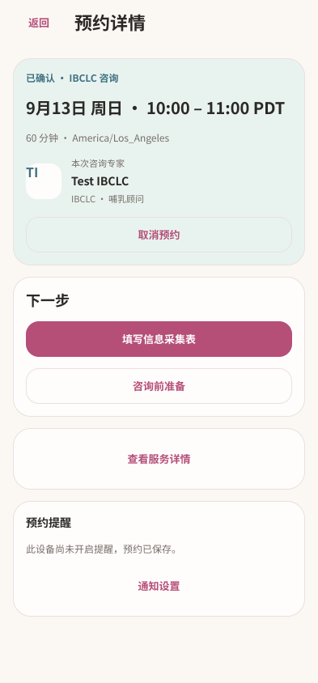
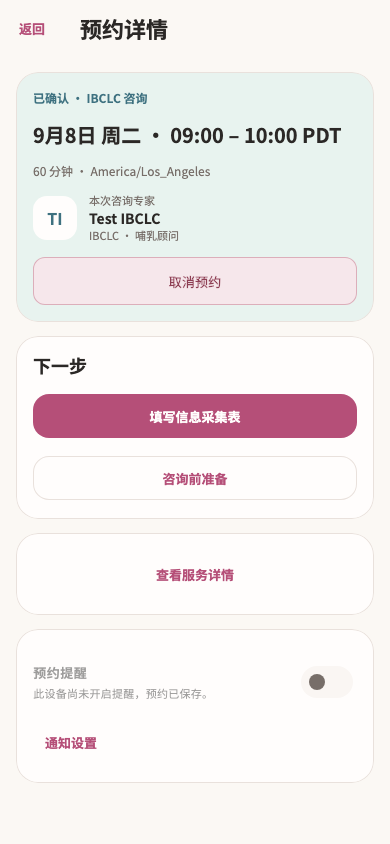
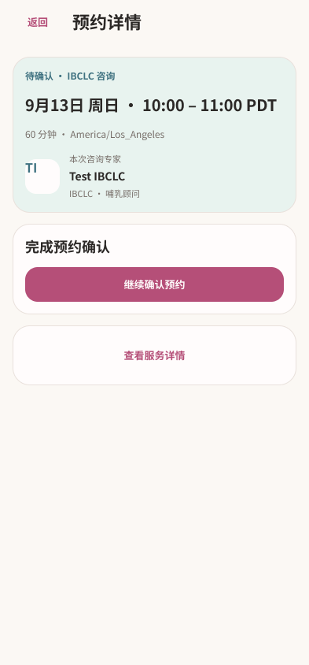
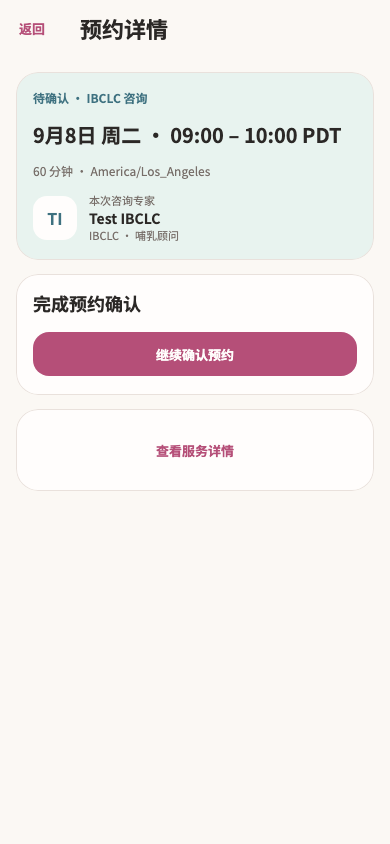

# 独立预约详情 · Figma → Flutter

本轮完成已有截图中的 `/services/appointments/:appointmentId` 独立预约详情。预约资料表、咨询准备与总结目标页仍继续按各自截图推进。

页面现在沿用预约流程的薄荷摘要，优先显示时间、时区、时长和真实专家。“下一步”、服务详情入口与提醒分别成组；待确认预约突出继续确认，已完成预约突出查看总结。已取消和已过期状态保留原服务详情入口。

## 设计依据

- [Figma 默认详情](https://www.figma.com/design/ePIoJkiMiXiug9ibpcgRbl?node-id=170-1108)
- [Figma 待确认](https://www.figma.com/design/ePIoJkiMiXiug9ibpcgRbl?node-id=170-1350)
- [Figma 大字号](https://www.figma.com/design/ePIoJkiMiXiug9ibpcgRbl?node-id=170-1408)
- [Figma 读取失败](https://www.figma.com/design/ePIoJkiMiXiug9ibpcgRbl?node-id=170-1397)

共 12 个画板，覆盖已确认、资料已保存、咨询中、完成、取消、过期、待确认、加载、失败和大字号，见 [节点清单](figma-nodes.json)。实际截图依据的 10 个条目见 [源清单](source-inventory.json)。先读取旧页面与当前实现，使用 Figma 中既有预约摘要组件建立新版状态，再读取设计上下文实现 Flutter。

| Figma | Flutter |
| --- | --- |
|  |  |
|  |  |

另见 [完整大字设计](figma-large.png)、[大字首屏](flutter-large.png)、[完成状态](flutter-completed.png)、[刷新失败](flutter-refresh-error.png)。Figma 大字画板展示完整滚动内容，Flutter 截图为当前可视区域。日期和本地化细节取决于测试数据及运行环境。

## 实现与验证

- 复用 `MomAppointmentSummary`、`MomSettingsCard`、`momSettingsTheme`，未创建另一套预约摘要、专家身份或取消弹窗。专家姓名与中性头像沿用真实预约数据。
- 初次读取、失败和重试使用共享卡片布局，长正文可滚动，页面内容裁切在 AppBar 下方。
- `_load`、`_open`、`_cancel`、`_back` 逐段比较保持一致。保留各预约状态的动作条件与目标路由，取消成功仍返回 `/me`；无返回栈时返回仍进入通知列表。
- 待确认操作由文字按钮提升为主按钮，但继续进入同一个 booking 路由。资料版本仍决定“填写”或“查看”文案。

最终联合回归 **139 项通过**，2 个相关文件静态分析无问题：[测试日志](tests.log)、[分析日志](analyze.log)、[文件指纹](verified-files.json)。

专项 18 项覆盖 320/390/430 宽度、1x/2x 字号、短屏安全区、取消/保留/重试、查询取消结果、读取失败与全部预约状态。新增 2 项测试验证：初次加载和刷新失败时不显示旧操作；从待确认预约进入 booking 后返回重新读取状态，根页面返回仍进入通知列表。补充了完成、咨询中、加载、刷新失败和大字待确认的视觉基线。

```sh
flutter test --no-pub test/modules/services/appointment_detail_test.dart test/modules/services/service_design_test.dart test/modules/services/booking_test.dart test/modules/services/service_progress_test.dart test/features/notifications/notification_widgets_test.dart test/modules/mom/mom_home_handoff_test.dart
flutter analyze --no-pub lib/modules/services/presentation/appointment_detail_page.dart test/modules/services/appointment_detail_test.dart
```

未运行 Session A 的截图写入测试，未重采集原生设备截图，未构建或发布 App。

## 增量交接

本轮清单总数仍为 2,367，变化的 `service-current-owned-booking`、`service-current-paused-booking` 两张截图已实际查看，内容对应上一轮完成的预检弹窗和无咨询次数状态，沿用已有设计。当前独立预约目标的待审条目随本轮更新。

下一候选为已有截图中的信息采集表及其确认状态。全量重构目标保持 active；状态数量不等于独立页面数量。
