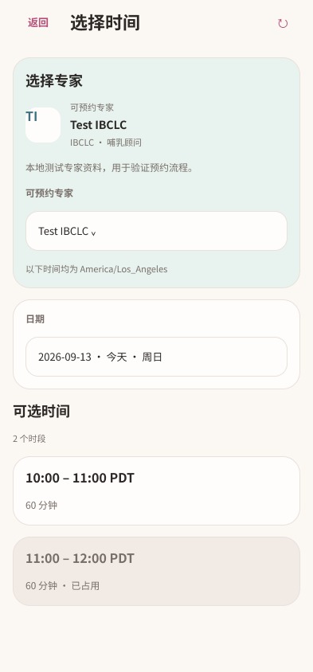
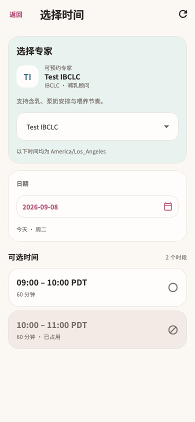
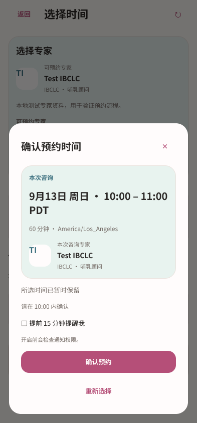
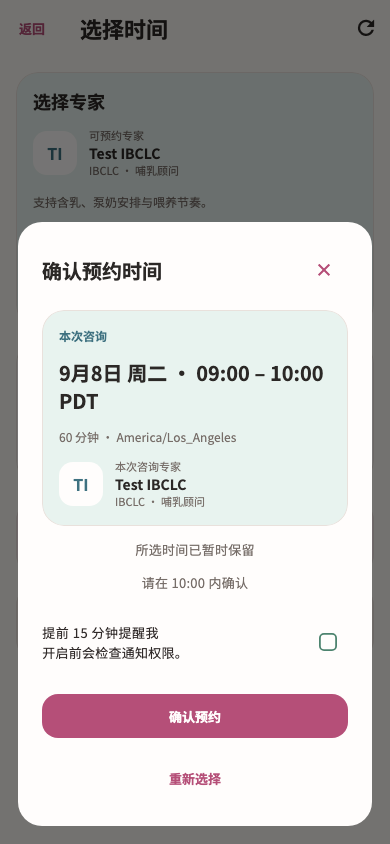

# 预约与确认流程 · Figma → Flutter

本轮完成已有截图中的 `/services/episodes/:episodeId/booking` 页面、预约前确认、时段确认和共用取消预约弹窗。独立 `/services/appointments/:id` 页面、信息采集表与咨询准备等仍按各自截图推进；本轮未将其算作整页完成。

新版将专家选择、日期和时段分组。已确认预约先展示咨询时间及真实专家，再集中呈现咨询前准备操作，提醒设置单独成卡。预约前确认用完整卡片承载服务适用性与紧急风险说明，替换原先嵌在边框中的标题。确认和取消沿用共享可滚动流程弹窗，正文随字号自然增高。

## 设计与依据

- [Figma 选择时间](https://www.figma.com/design/ePIoJkiMiXiug9ibpcgRbl?node-id=165-1108)
- [Figma 已确认预约](https://www.figma.com/design/ePIoJkiMiXiug9ibpcgRbl?node-id=165-1191)
- [Figma 预约前确认](https://www.figma.com/design/ePIoJkiMiXiug9ibpcgRbl?node-id=165-1414)
- [Figma 确认预约时间](https://www.figma.com/design/ePIoJkiMiXiug9ibpcgRbl?node-id=165-1630)
- [Figma 取消预约](https://www.figma.com/design/ePIoJkiMiXiug9ibpcgRbl?node-id=165-1865)
- [Figma 预约摘要组件](https://www.figma.com/design/ePIoJkiMiXiug9ibpcgRbl?node-id=168-1121)
- [Figma 专家身份组件](https://www.figma.com/design/ePIoJkiMiXiug9ibpcgRbl?node-id=168-1129)

共 32 个状态画板和 2 个组件，见 [节点清单](figma-nodes.json)。覆盖未确认/已确认/咨询中、无次数、首次及可选时间加载/失败/空态、时段保留、资格确认、区域不支持、紧急风险、提交中与结果未确认、保留过期、取消及恢复、日期选择/输入错误和双倍字号。

源截图依据包含 60 个对应预约路由条目，保存在 [截图清单](source-inventory.json)。阅读实际页面、预检、保留、确认及取消截图和当前代码后，先在 Figma 建立新版布局，检查现有组件库并读取设计上下文，再实现 Flutter。使用现有妈妈页变量、字体、卡片和流程弹窗。

| Figma | Flutter |
| --- | --- |
|  |  |
|  |  |

另见 [预检设计](figma-precheck.png)、[预检 Flutter](flutter-precheck.png)、[大字预检](figma-precheck-large.png)、[已确认设计](figma-confirmed.png)、[已确认 Flutter](flutter-confirmed.png)、[大字咨询前准备](flutter-confirmed-large.png)、[日期错误](flutter-date-invalid.png)、[取消弹窗](flutter-cancel.png)。Figma 表达信息层级与滚动规则；系统单选框、日历、本地化标签与不同测试日期会产生细节差异。

## 实现与业务保留

- `booking_page.dart` 使用妈妈页局部主题，专家与日期分卡，已确认状态复用 `MomAppointmentSummary`，准备操作和提醒分别成组。保留原 App 外壳与导航，没有新增底部导航。
- `mom_appointment_widgets.dart` 新增 `MomAppointmentSummary`、`MomServiceExpertIdentity`。日期、时段、时区、时长、专家姓名均由原预约数据提供；API 没有头像字段，采用姓名首字母中性头像，不使用通用合照冒充具体专家。
- `booking_flow_dialogs.dart` 复用 `MomSettingsFlowDialog` 和 `MomSettingsCard`，扩大风险说明正文空间。资格与风险判断、区域支持、按钮禁用条件、提交等待、时段有效性与重试分支保持原样。
- 共用 `appointment_cancel_dialog.dart` 同步到已设计的取消弹窗。独立预约页仍使用其旧详情卡，本轮只改变它调用的共用取消弹窗；取消操作和版本恢复逻辑不变。
- 日期选择器增加可选局部主题参数，只由本次预约入口传入。原日期范围、值处理、系统语言和大字输入模式保持不变；其他调用方默认行为不变。
- 预约页从 `_load` 开始的所有异步操作方法逐段比较，仅增加日期选择器主题参数，其余保持一致。取消 `_run` 保持一致，controller、repository、API、路由、提醒授权与预约后信息采集回调均未修改。
- 忙碌时仍禁止返回和关闭；不可选时段不提交；不确定提交继续使用原操作；重新选择仍按原规则释放有效保留；取消后仍走原返回路径。

## 验证

最终 **156 项联合测试通过**，7 个相关文件静态分析无问题。证据：[测试日志](tests.log)、[分析日志](analyze.log)、[文件指纹](verified-files.json)。

预约与取消专项共 43 项，覆盖 320/390/430 宽度、1x/2x 字号、预检风险门槛、保留确认、忙碌关闭/返回拦截、确认重试沿用原版本、保留过期、恢复已有预约、取消重试、真实预约回调与时区时间标签。

新增 5 项测试覆盖 393/1x 与 320/2x 的首次读取失败恢复、无时段、不可选时段不创建保留，以及已确认预约的准备操作可达性；另验证大字日期输入错误仍保留弹窗、取消后原日期不变。关闭断言更新为新图标的无障碍标签，不改变业务期望。

```sh
flutter test --no-pub test/modules/services/booking_test.dart test/modules/services/appointment_detail_test.dart test/modules/services/service_design_test.dart test/modules/services/service_renew_test.dart test/modules/services/service_purchase_test.dart test/shared/date_time_picker_test.dart test/features/notifications/notification_widgets_test.dart test/modules/mom/mom_home_handoff_test.dart
flutter analyze --no-pub lib/modules/services/presentation/booking_page.dart lib/modules/services/presentation/booking_flow_dialogs.dart lib/modules/services/presentation/mom_appointment_widgets.dart lib/modules/services/presentation/appointment_cancel_dialog.dart lib/shared/widgets/date_time_picker.dart test/modules/services/booking_test.dart test/modules/services/appointment_detail_test.dart
```

未运行 Session A 的截图写入测试，未重采集原生设备截图，未构建或发布 App。

## 增量交接

本轮逐条核对此前通知导航与服务增量的路由、触发条件，并结合代表截图和现有组件验证，将 83 个状态标为沿用已完成设计，见 [增量复核](increment-review.json)。登录、妈妈页、聊天错误与其他服务目标仍按各自范围保留待审，没有按来源页面批量算作完成。

开始与结束观察的截图状态总数均为 2,367。预约页相关待审条目随本轮更新，剩余范围以 [总进度](../progress.json) 和 [待审队列](../pending-inventory.json) 为准。

下一候选为已有截图中的独立预约详情，随后继续信息采集和咨询前准备。完整任务保持 active。
