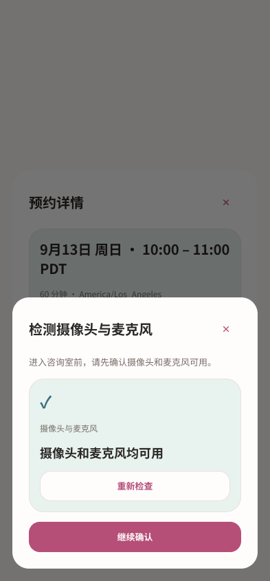
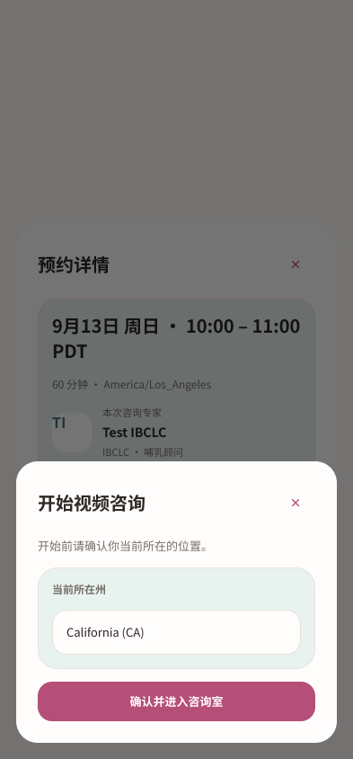
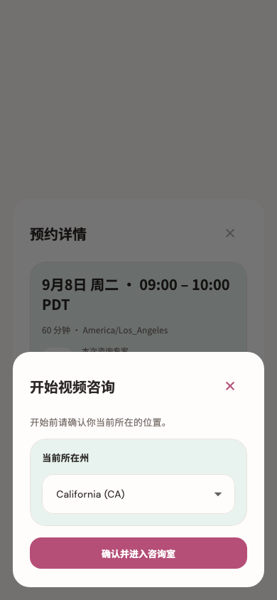
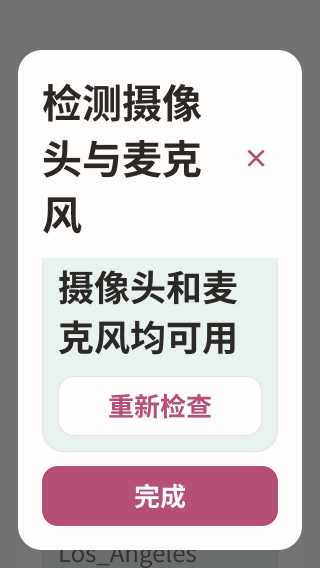
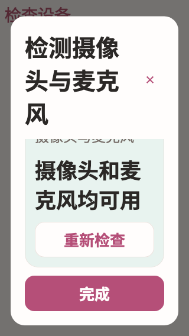

# 设备检查与咨询授权 · Figma → Flutter

本轮完成已有截图中的用户设备检测、当前所在州确认和本次服务的视频授权。实时咨询室、离开确认、结束结果继续按各自截图推进。

设备检查将状态作为主要信息，检查结果和重试按钮分行显示；位置选择与明确授权分别放入薄荷卡片。所有弹窗复用固定标题、关闭按钮和独立滚动正文。大字模式下州名字段可自然增高，保留完整州名和缩写。

## 设计证据

- [Figma 设备可用](https://www.figma.com/design/ePIoJkiMiXiug9ibpcgRbl?node-id=183-1153)
- [Figma 位置确认](https://www.figma.com/design/ePIoJkiMiXiug9ibpcgRbl?node-id=183-1388)
- [Figma 视频授权](https://www.figma.com/design/ePIoJkiMiXiug9ibpcgRbl?node-id=183-1900)
- [Figma 短屏操作区](https://www.figma.com/design/ePIoJkiMiXiug9ibpcgRbl?node-id=184-1108)

先读取旧截图与实现，实际调用 Figma 建立新版状态，再读取设计上下文落实 Flutter。共 27 个画板，覆盖检测中、完成、失败、重新检查、州选择、授权未完成、忙碌、进入准备、网络失败、条件变化和大小字号。见 [节点](figma-nodes.json)、[设计上下文](figma-design-context.json) 和 [36 个截图来源](source-inventory.json)。

| Figma | Flutter |
| --- | --- |
|  |  |
|  |  |
|  |  |

另见 [完整大字州名](screens/preflight-ready-320-2x.png)、[授权待勾选](screens/preflight-consent-320-2x.png) 和 [打开期间资料失效](screens/preflight-changed-intake-320-2x.png)。Figma 以准备页为背景；独立设备测试使用简单宿主。日期和背景滚动位置由测试数据与进入路径决定。

## 实现与验证

- 复用 `MomSettingsFlowDialog`、`MomSettingsCard`、`momSettingsTheme`；未另建弹窗或卡片体系。
- 检查打开时仍只请求一次设备，检查完成仍释放本机轨道，关闭时清理仍执行；检查通过后必须点击“继续确认”。没有改动权限服务或系统权限弹窗。
- 当前州校验、服务器授权、重试版本、等待准备和关闭取消进入的原逻辑保持。视频授权只作用于本次服务，勾选之前确认按钮禁用。
- 逐段比较设备生命周期、检查与释放、开始确认方法、授权保存方法和进入条件均一致，见 [行为比较](behavior-comparison.json)。专家使用的本机预览组件未修改。

扩展检查 **50 项通过**，咨询模块联合 **109 项通过**；6 个相关文件静态分析无问题。覆盖 320/390/430 宽度、1x/2x 字号、短屏、大字操作可达、权限失败和迟到资源释放、关闭和忙碌拦截、位置拒绝、授权原版本重试。

新增检查在确认弹窗打开后改变资料、视频可用性和时间窗口：按钮立即禁用，恢复条件后可手动继续，期间不会提交位置或加入房间。原关闭测试改为通过明确无障碍标签定位图标按钮。相关视觉基线更新后，最终联合回归不带 `--update-goldens`。

证据：[扩展日志](tests.log)、[联合日志](joint-tests.log)、[静态分析](analyze.log)、[文件指纹](verified-files.json)。未运行 Session A 的截图写入测试，未重采集原生设备截图，未构建或发布 App。

## 增量交接

此前 54 个购买分支已复核为现有设计覆盖，当前购买专项 23 项通过，见 [复核记录](../20260914-purchase-branches/REVIEW.md)。本轮新增 47 个 progress-current 截图，清单总数增至 2,539，已保留至待审队列。

下一步核对服务进度增量，并继续实时咨询室及离开/结果状态。续购和咨询总结目标页仍需独立处理。全量目标保持 active；截图数量不是独立页面数量。
