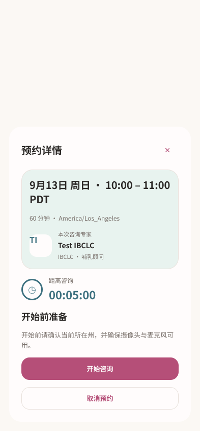
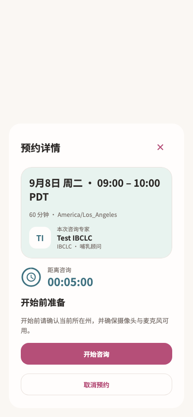
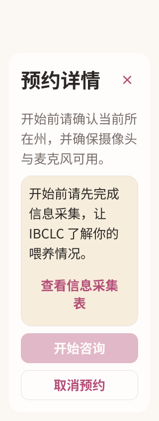
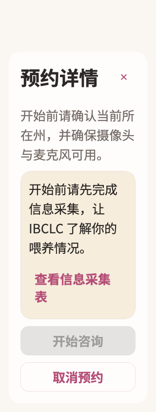

# 咨询前准备 · Figma → Flutter

本轮完成已有截图中的用户咨询准备状态，以及从妈妈页打开的准备浮层、加载和失败状态。设备检查、位置与视频授权确认、实时咨询室和结束结果继续按各自截图推进，不能将本报告视为整个 room 路由完成。

新版准备页将预约时间、时区、时长和真实专家放入共享薄荷摘要；倒计时与开始前待办分组呈现。缺少信息采集、授权失效、视频未开放和进入超时的提示靠近操作。开始与取消上下排列，长内容独立滚动，标题和关闭按钮保持可访问。

## 设计证据

- [Figma 默认准备](https://www.figma.com/design/ePIoJkiMiXiug9ibpcgRbl?node-id=178-1108)
- [Figma 首页浮层](https://www.figma.com/design/ePIoJkiMiXiug9ibpcgRbl?node-id=178-1436)
- [Figma 信息采集待办](https://www.figma.com/design/ePIoJkiMiXiug9ibpcgRbl?node-id=178-1206)
- [Figma 大字滚动操作区](https://www.figma.com/design/ePIoJkiMiXiug9ibpcgRbl?node-id=179-1139)

先读取原截图、页面实现和妈妈页设计上下文，实际调用 Figma 建立 24 个画板，再读取设计上下文实现 Flutter。复用已有预约摘要和流程弹窗模式，见 [节点清单](figma-nodes.json)、[设计上下文](figma-design-context.json) 及 [33 个源截图条目](source-inventory.json)。

| Figma | Flutter |
| --- | --- |
|  |  |
|  |  |

另见 [首页准备](screens/home-preparation-ready-390.png)、[短屏恢复](screens/home-preparation-error-short-320-2x.png)、[授权失效](screens/preparation-case-consent-390.png) 和 [刷新失败](screens/preparation-refresh-error-320-2x.png)。Figma 以既有妈妈页为浮层背景，Widget 测试使用独立宿主或服务卡片；预约日期由各自测试数据提供。

## 实现和验证

- 使用 `MomAppointmentSummary`、`MomSettingsCard`、`MomSettingsFlowDialog`、`momSettingsTheme`，没有新增另一套摘要、卡片或弹窗组件。
- 每秒倒计时、服务器开放窗口、测试提前进入、资料和授权条件、busy 锁定均保留。没有自动进入咨询室，进入仍经过设备检查及后续确认。
- Room 页面仅替换准备浮层的外观，生命周期、返回/离开、取消、进入、设备与授权流程，以及准备后的全部方法保持一致。具体比较见 [行为证据](behavior-comparison.json)。
- 未修改 room controller、后端、授权范围、权限调用或音视频连接逻辑。准备页取消操作仍由原回调决定是否显示。

专项 **19 项通过**，咨询模块及信息采集、预约详情联合 **152 项通过**；4 个相关文件静态分析无问题。新增检查涵盖刷新失败保留预约信息、重试恢复、不自动加入、进行中重入、大字授权待办、短屏加载恢复，以及滚动后的操作可达性。

后续确认弹窗的背景由旧准备卡变为新版摘要；已对照前后截图检查前景内容未变，定向更新相关背景基线后，不带 `--update-goldens` 完成最终联合回归。证据：[专项日志](tests.log)、[背景基线检查](background-baseline-tests.log)、[联合日志](joint-tests.log)、[静态分析](analyze.log)、[文件指纹](verified-files.json)。

```sh
flutter test --no-pub test/modules/consultation/room_outcome_design_test.dart test/modules/consultation/room_leave_recovery_test.dart test/modules/consultation/room_controller_test.dart test/modules/consultation/room_design_test.dart test/modules/consultation/home_consultation_dialog_test.dart test/modules/consultation/consultation_start_test.dart test/modules/consultation/device_check_test.dart test/modules/consultation/consultation_preparation_test.dart test/modules/consultation/device_check_design_test.dart test/modules/consultation/room_page_test.dart test/modules/consultation/user_video_test.dart test/modules/services/intake_test.dart test/modules/services/appointment_detail_test.dart
flutter analyze --no-pub lib/modules/consultation/presentation/consultation_preparation.dart lib/modules/consultation/presentation/room_page.dart test/modules/consultation/consultation_preparation_test.dart test/modules/consultation/home_consultation_dialog_test.dart
```

未运行 Session A 的截图写入测试，未重采集原生设备截图，未构建或发布 App。

## 增量交接

之前 71 个购买增量已复核为现有设计覆盖，见 [购买增量复核](../20260914-purchase-increment/REVIEW.md)，对应 33 项当前回归通过。本轮又新增 54 个 purchase-branches-current 状态，清单总数为 2,492，已保留到待审队列。

下一步先核对购买分支增量，再继续设备检查、位置/视频授权确认和实时咨询室。全量目标保持 active；截图状态数量不代表独立页面数量。
