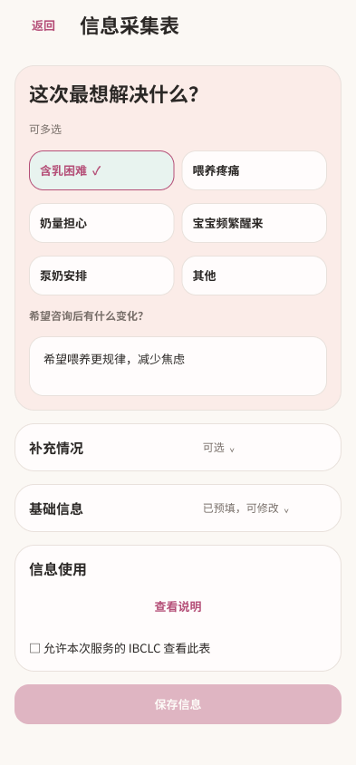
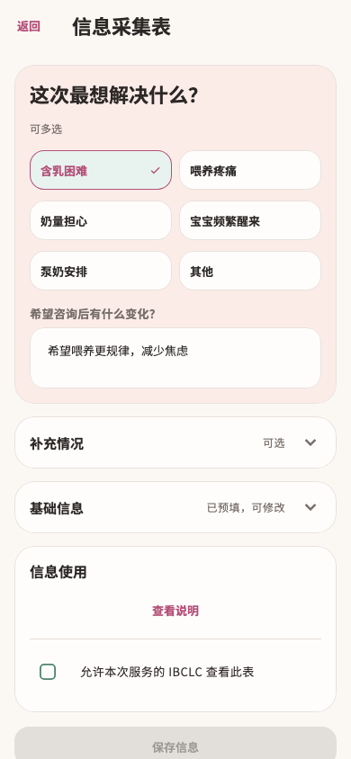
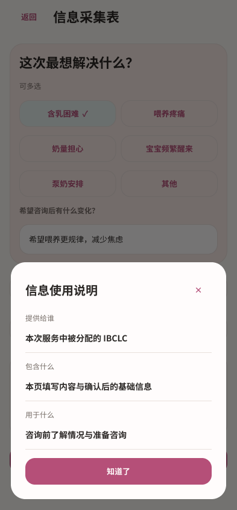
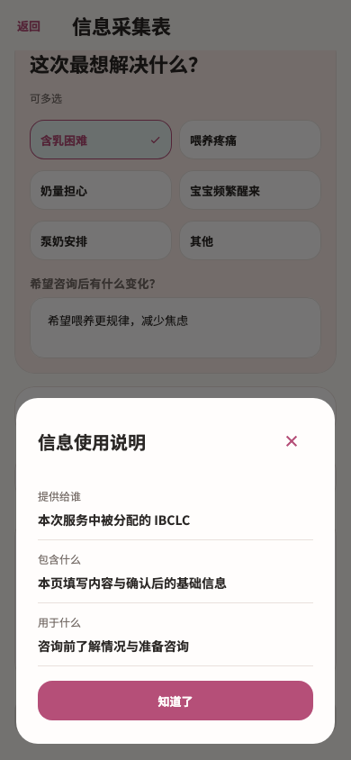
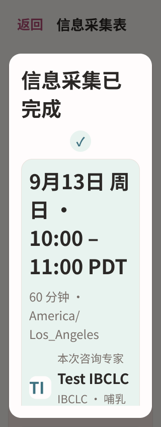
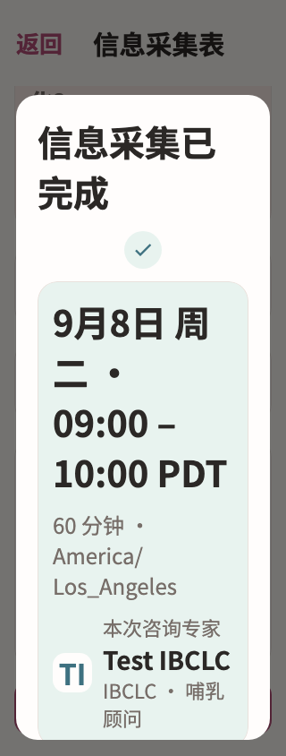

# 信息采集表 · Figma → Flutter

本轮完成截图已有的 `/services/appointments/:appointmentId/intake` 页面、授权说明、完成提示及保存恢复状态。咨询准备和咨询室继续按各自截图推进。

咨询重点使用浅粉卡片，选项在普通字号下为双列、大字模式为单列。补充情况与基础信息成为独立分组，大字标题和状态上下排列；信息使用说明保留原授权范围并改为纵向阅读。完成提示复用薄荷预约摘要和真实专家身份。

## 设计依据

- [Figma 表单](https://www.figma.com/design/ePIoJkiMiXiug9ibpcgRbl?node-id=173-1108)
- [Figma 基础信息](https://www.figma.com/design/ePIoJkiMiXiug9ibpcgRbl?node-id=173-1262)
- [Figma 授权说明](https://www.figma.com/design/ePIoJkiMiXiug9ibpcgRbl?node-id=173-1633)
- [Figma 大字完成提示](https://www.figma.com/design/ePIoJkiMiXiug9ibpcgRbl?node-id=174-1169)

先阅读原页面和截图，实际使用 Figma 工具建立设计，再读取设计上下文实现 Flutter。共 26 个画板，包含填写、预填、展开、授权、保存中、结果未确认、离开提示、加载失败、未确认预约拦截、菜单、日期选择和大字号，见 [节点清单](figma-nodes.json)。依据的 33 个截图条目见 [源清单](source-inventory.json)。

| Figma | Flutter |
| --- | --- |
|  |  |
|  |  |
|  |  |

另见 [基础信息设计](figma/profile.png)、[大字菜单](screens/intake-region-menu-320-2x.png)、[大字日期输入](screens/intake-birth-picker-320-2x.png)、[离开确认](screens/intake-discard-320-2x.png)。完整 Figma 表单高度包含滚动内容，Flutter 截图为当前视口；日期、月龄、文案本地化随真实数据与环境计算。

## 实现与验证

- 复用 `MomSettingsCard`、`MomSettingsFlowDialog`、`MomAppointmentSummary`、`momSettingsTheme`；新增的 `showClose` 默认为 true，仅此完成提示传 false，保留原先没有关闭入口的行为。
- `confirmDiscard` 仅新增可选主题参数；日期选择器复用已有可选主题参数。其他调用者的默认行为不变。
- 控制器、保存版本、授权版本、重试快照和字段校验未修改。前次内容预填仍要求重新授权，修改已有表单仍直接返回，首次提交才显示预问诊入口。
- `_close`、`_reload`、`_birthDate` 排除主题参数后逐段一致；保存弹窗前后的分支、导航与回调一致，见 [行为比较](behavior-comparison.json)。

专项 **26 项通过**，联合 **183 项通过**；4 个文件静态分析无问题。覆盖 320/390/430 宽度、1x/2x 字号、显式授权、保存中拦截、原快照重试、离开/继续、加载恢复、菜单、日期边界与未确认预约状态。新增视觉基线通过后，联合回归未使用 `--update-goldens`。日志见 [专项](tests.log)、[联合](joint-tests.log)、[静态分析](analyze.log) 与 [文件指纹](verified-files.json)。

```sh
flutter test --no-pub test/modules/services/intake_test.dart test/modules/services/booking_test.dart test/modules/services/service_design_test.dart test/modules/services/service_progress_test.dart test/modules/services/appointment_detail_test.dart test/modules/profile/privacy_redesign_states_test.dart test/features/auth/account_redesign_states_test.dart test/features/notifications/notification_widgets_test.dart test/modules/mom/mom_home_handoff_test.dart
flutter analyze --no-pub lib/modules/services/presentation/intake_page.dart lib/shared/widgets/mom_settings_widgets.dart lib/shared/widgets/confirm_discard.dart test/modules/services/intake_test.dart
```

未运行 Session A 的截图写入测试，未重采集原生设备截图，未构建或发布 App。

## 增量交接

清单由 2,367 增至 2,438 个状态，新增 71 个 `purchase-current` 状态已保留至待审队列。本次信息采集目标对应的待审条目已更新。下一步先对照现有购买设计复核这些增量，再推进咨询前准备。全量重构目标保持 active；状态数不等于独立页面数。
