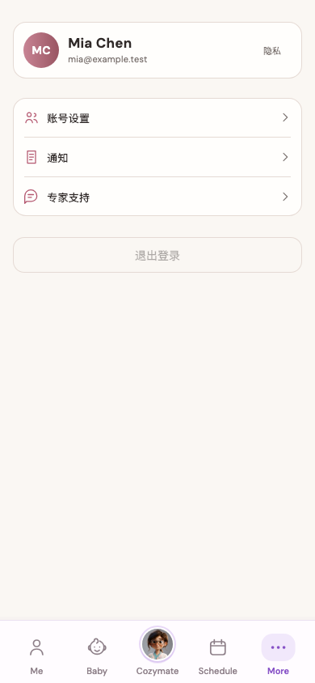
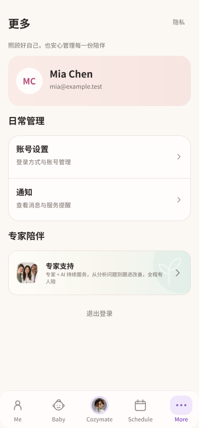
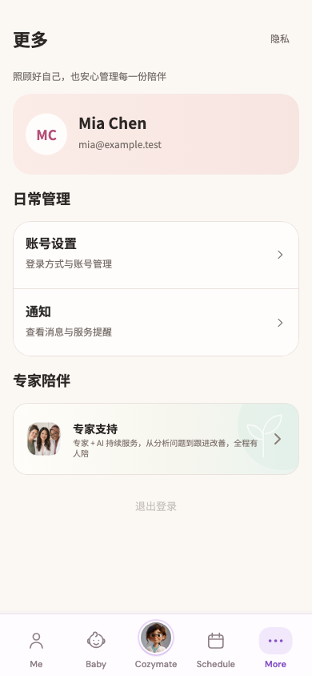

# More 页重构交付 · 2026-09-14

`/more` 已按「旧截图 → 妈妈页设计上下文 → Figma → Flutter → 验证」完成本轮重构。整套 App 的增量任务仍在继续。

## 设计与证据

| 内容 | Figma 节点 |
| --- | --- |
| 默认态 | [122:9](https://www.figma.com/design/ePIoJkiMiXiug9ibpcgRbl?node-id=122-9) |
| 账号加载态 | [122:105](https://www.figma.com/design/ePIoJkiMiXiug9ibpcgRbl?node-id=122-105) |
| 账号不可用、未读与禁用退出 | [122:185](https://www.figma.com/design/ePIoJkiMiXiug9ibpcgRbl?node-id=122-185) |
| 窄屏、两倍字号长账号信息 | [124:68](https://www.figma.com/design/ePIoJkiMiXiug9ibpcgRbl?node-id=124-68) |

现有截图来源为 `07-me/more` 与实际路由对应的 `07-me/account-journey-more`。本轮没有重新整理页面或修改截图清单。

| 原截图 | Figma 默认态 | Flutter 默认态 |
| --- | --- | --- |
|  |  |  |

页面组织为标题和隐私入口、账号身份、日常管理、专家陪伴、低优先级退出。账号设置与通知共用分组卡片，专家入口复用妈妈页合照、薄荷渐变与叶片装饰，形成信息和服务入口的主次关系。

账号加载或任一现有接口不可用时仍保留可访问入口；未读数量来自原通知状态。窄屏卡片宽度小于 328 或字号倍率大于 1.3 时，头像与身份改为纵向排列，姓名和邮箱完整换行。长页面滚动可达退出入口。

## 实现

- `lib/modules/profile/presentation/more_page.dart`：页面布局、账号卡和状态呈现。隐私、账号、通知、服务入口与退出回调保留原流程。
- `lib/shared/widgets/mom_settings_row.dart` ↔ Figma `122:2`：设置行，支持未读数量和大字号。
- `lib/shared/widgets/mom_companion_widgets.dart` ↔ Figma 专家组件 `122:41`：复用妈妈页表面、标题和专家入口。通过 `mom_home_sections.dart` 导出维持原引用。
- `lib/shared/design_system/mom_home_tokens.dart`：共用表面色和外边距；沿用原妈妈页颜色、字体与渐变。

Figma 默认态和响应式账号卡均在对应 Flutter 修改前读取了 `get_design_context`。本轮没有修改 API 契约、认证实现或服务购买逻辑。

## 验证

`flutter analyze --no-pub` 检查 6 个改动文件，无问题。最终联合测试 **43 项通过**：

```sh
flutter test --no-pub \
  test/app/more_design_test.dart \
  test/app/more_redesign_states_test.dart \
  test/modules/mom/mom_home_handoff_test.dart \
  test/features/notifications/notification_widgets_test.dart \
  --reporter expanded
```

覆盖 More 的 320 / 390 / 430 宽度及 1× / 2× 字号入口操作；新增测试覆盖加载、接口不可用、未读、长姓名邮箱、滚动与退出回调。妈妈首页和通知既有回归通过，未更新其基准图。仅 More 相关 Golden 按已核验设计更新。

已查看默认、加载、不可用、长信息与大字号渲染，无测试捕获的 overflow 或布局异常。长信息证据见 [Flutter](flutter-responsive-account.png) 与 [Figma](figma-responsive-account.png)。

Figma 组件库 P3 交付为设置行与专家入口两个组件；P4 质量检查完成。设计到实现 G5 资产核验通过：沿用原专家合照 44×44、箭头 20×20、光晕 112×112、叶片 58×65 及设置行原 SVG；全文字体与字号已审计。详见 [Figma 审计](figma-qa.json)。

Figma 与 Flutter 因文字排版度量存在少量纵向差异；底部导航沿用既有 App 自适应实现，普通字号实际约 78 高，Figma 参考为 74，高字号会增高。本轮不声称逐像素完全一致。测试为 Widget 与视觉回归，未重新执行原生设备流程、构建 APK 或部署。

原始验证输出：[静态分析](analyze.log)、[测试](tests.log)、[验证文件指纹](verified-files.json)、[Figma 创建节点记录](figma-state.json)。最后一次观察为 2,060 个截图状态，相对于已保存观察没有新增、修改或删除，见 [增量结果](inventory-delta.json)。其他页面仍按总进度逐一处理。
