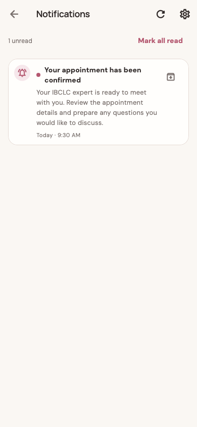
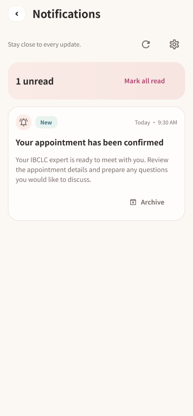
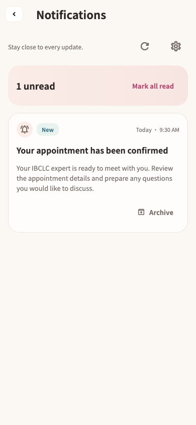
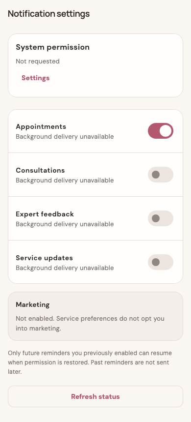
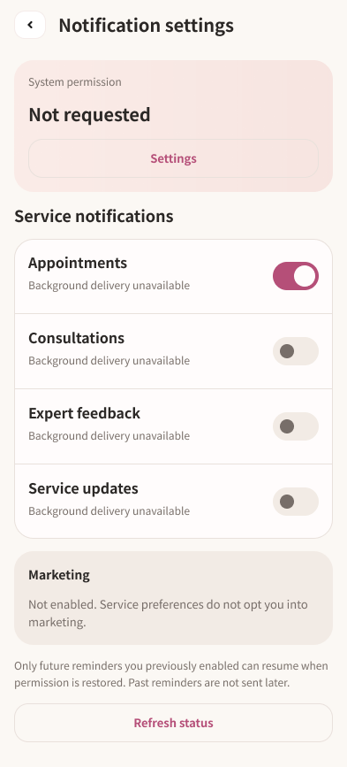
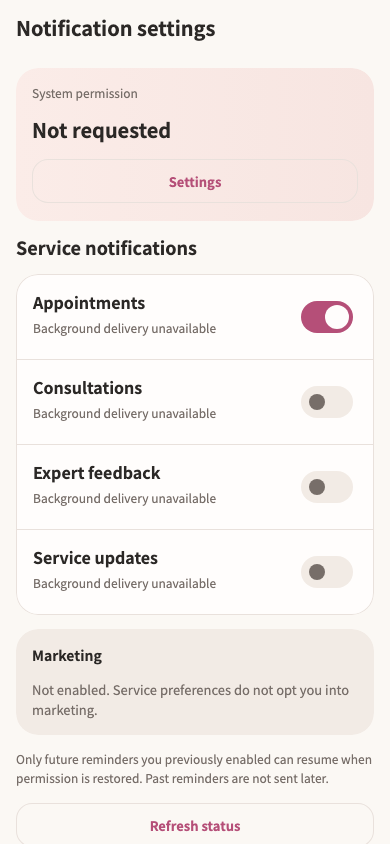

# 通知模块重构交付 · 2026-09-14

`/notifications` 与 `/notifications/settings` 已完成现有截图 → Figma → Flutter → 视觉与交互验证的本轮重构。权限说明和前往系统设置的两类弹窗一并设计。通知没有新增详情页，消息仍进入原有服务目标页面。

## 设计

| 内容 | Figma |
| --- | --- |
| 通知列表 / 已读 / 空态 | [134:68](https://www.figma.com/design/ePIoJkiMiXiug9ibpcgRbl?node-id=134-68) / [135:82](https://www.figma.com/design/ePIoJkiMiXiug9ibpcgRbl?node-id=135-82) / [135:117](https://www.figma.com/design/ePIoJkiMiXiug9ibpcgRbl?node-id=135-117) |
| 加载 / 首次失败 / 保留内容失败 | [135:155](https://www.figma.com/design/ePIoJkiMiXiug9ibpcgRbl?node-id=135-155) / [135:194](https://www.figma.com/design/ePIoJkiMiXiug9ibpcgRbl?node-id=135-194) / [135:234](https://www.figma.com/design/ePIoJkiMiXiug9ibpcgRbl?node-id=135-234) |
| 分页 / 分页等待 / 归档等待 / 批量已读等待 | [136:775](https://www.figma.com/design/ePIoJkiMiXiug9ibpcgRbl?node-id=136-775) / [137:357](https://www.figma.com/design/ePIoJkiMiXiug9ibpcgRbl?node-id=137-357) / [136:813](https://www.figma.com/design/ePIoJkiMiXiug9ibpcgRbl?node-id=136-813) / [137:336](https://www.figma.com/design/ePIoJkiMiXiug9ibpcgRbl?node-id=137-336) |
| 设置页与权限状态 | [135:274](https://www.figma.com/design/ePIoJkiMiXiug9ibpcgRbl?node-id=135-274)；Allowed `136:187`、Denied `136:249`、Provisional `136:311`、Unavailable `136:373` |
| 设置加载、偏好失败、推送未就绪、设备无协调器 | `136:420`、`136:468`、`136:497`、`136:548` |
| 权限说明 / 系统设置引导 | [136:577](https://www.figma.com/design/ePIoJkiMiXiug9ibpcgRbl?node-id=136-577) / [136:612](https://www.figma.com/design/ePIoJkiMiXiug9ibpcgRbl?node-id=136-612) |
| 大字号列表 / 设置长页 | [136:864](https://www.figma.com/design/ePIoJkiMiXiug9ibpcgRbl?node-id=136-864) / [136:929](https://www.figma.com/design/ePIoJkiMiXiug9ibpcgRbl?node-id=136-929) |

共 23 个状态画板。交付说明节点为 `139:377`。已经查询并检查现有设计系统，复用妈妈页、More、账号页的颜色、字体、表面和确认框模式，并在编码前读取列表、设置、弹窗及大字号设置的 `get_design_context`。

| 通知原截图 | Figma | Flutter |
| --- | --- | --- |
|  |  |  |

| 设置原截图 | Figma 完整长页 | Flutter 视口 |
| --- | --- | --- |
|  |  |  |

消息正文改用整张卡片宽度，类型、未读标记与时间放在顶部，归档放在底部独立操作区。列表顶部区分全局未读数和工具操作。首次加载失败不再同时显示「没有通知」，有内容时保留原消息并提供重试。设置页按系统权限、服务偏好、营销说明和恢复提醒规则组织，沿用原始英文文案与数据含义。

## 实现与复用

- `notifications_page.dart`：新布局与消息卡，保留传入的打开目标、刷新、标记已读、归档和分页回调。原消息类型图标映射及时间格式函数逐段比较未变。
- `notification_settings_page.dart`：权限摘要、偏好组、加载与错误显示。原 `_load` / `_set` 业务方法逐段比较未变。
- `notification_permission_dialogs.dart`：继续使用原确认和取消返回值及动画，只替换为共用确认框。
- `mom_settings_widgets.dart`：`MomSettingsCard` 复用 `MomHomeSurface`；`MomSettingsDialog` 从账号页已有布局提取。账号页仅改用此组件，其原 Golden 无需更新。
- `mom_settings_theme.dart`：局部主题补充偏好开关样式，未改变全局主题或权限控制器。

Figma 的 `MomCozy/NotificationCard` (`134:88`) 映射 `_NotificationCard`；`MomCozy/PreferenceRow` (`136:153`) 映射本页按共用字体和间距配置的原生 `SwitchListTile`。新增 `MomCozy/paragraph` 样式用于 13 px、1.55 行高的正文。

图标保持原 Flutter `Icons.*`，Figma 参考 SVG 直接从当前 SDK 的同一 MaterialIcons 字形提取，保存在 [图标参考目录](material-icons/)，包含许可证。返回图形复用原 `back-button.svg`。没有新增运行时图片、字体或依赖。

## 验证

最终静态分析 7 个文件无问题；联合回归 **118 项全部通过**。

```sh
flutter test --no-pub \
  test/features/notifications/notification_design_test.dart \
  test/features/notifications/notification_redesign_states_test.dart \
  test/features/notifications/notification_widgets_test.dart \
  test/features/notifications/notifications_page_test.dart \
  test/features/notifications/notifications_controller_test.dart \
  test/features/notifications/notification_coordinator_test.dart \
  test/features/notifications/notification_permission_controller_test.dart \
  test/features/auth/auth_design_test.dart \
  test/features/auth/account_page_test.dart \
  test/features/auth/account_redesign_states_test.dart \
  test/app/more_design_test.dart \
  test/app/more_redesign_states_test.dart \
  test/modules/mom/mom_home_handoff_test.dart \
  --reporter expanded
```

原有 320 / 390 / 430 宽度、1× / 2× 字号验证通过。新增 8 项测试覆盖 393/1× 与 320/2× 下的首次加载与重试、打开原目标、批量已读等待、分页等待和失败、归档等待和失败后保留内容、权限拒绝与恢复、偏好加载失败与恢复、设备不可用和完整长页操作。大字号列表测试先滚动到目标再操作，符合真实使用路径。

视觉检查包括默认列表、设置、两类确认框、大字号正文、长页底部和失败状态。已允许设置页标题换行，避免权限弹窗出现后标题被截断。两页主体显式裁切，滚动内容不会绘制到标题栏区域。

Figma 与实现核验通过：字体为 Noto Sans SC 对应 App 的 `NotoSansSCHome`；消息类型图标 20、底部归档图标 16、返回图形 36×32；间距 14、外边距 16、常规卡片圆角 22。原生按钮保留至少 44 的操作高度。详见 [Figma 审计](figma-qa.json)。

Figma 大字号画板表达换行与滚动规则，Flutter AppBar 仍采用平台标题字号上限；标题最多两行。原生开关、弹窗和字体排版存在少量尺寸差异，正文和操作保持系统字号适配。设置页超过一屏，需要滚动至底部刷新；视口截图并非完整页面长度。错误背景在实现中复用妈妈页原有暖色渐变。未执行原生设备重采集、APK 构建或部署。

证据：[静态分析](analyze.log)、[联合测试](tests.log)、[文件指纹](verified-files.json)、[大字号弹窗](flutter-settings-offer-large.png)、[保留内容失败](flutter-retained-error.png)、[Figma 节点记录](figma-state.json)。

## 增量交接

本轮观察到 52 个新增截图状态，主要为新版账号流程，总数达到 2,150；已保存到总任务待审队列。之前待审的 4 个通知相关样本已查看并标记为本次设计覆盖。其余新增项继续待审，不按截图数量计算页面完成数，也不据此重做稳定页面。下一轮先判断新增账号 / More 状态的覆盖情况，再处理已有截图中的 `/privacy`。
