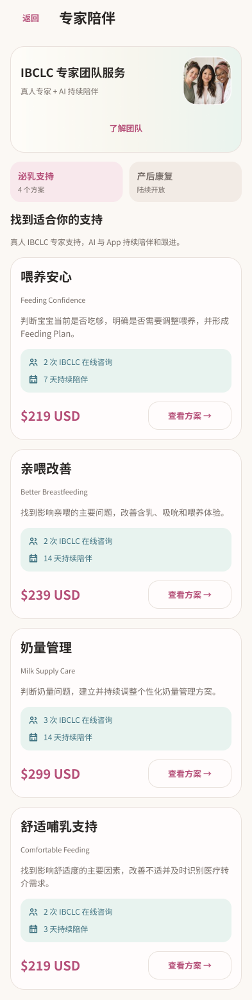
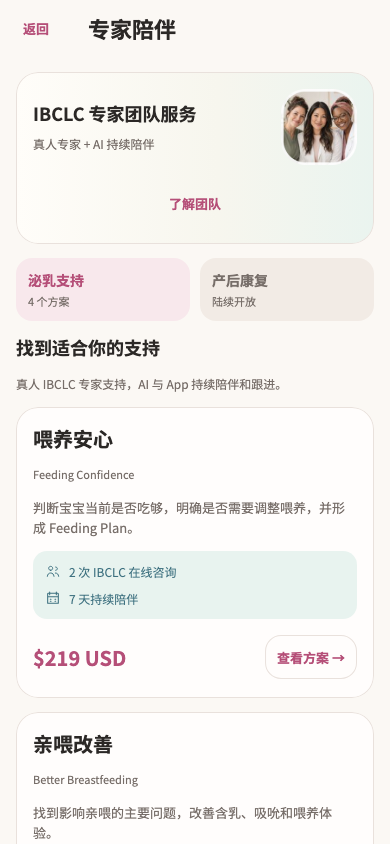

# 专家服务目录 · Figma → Flutter

本轮完成已有截图中的 `/services` 目录与团队资料弹窗。全量重构仍在进行中；方案详情、购买及服务进度页面继续按各自截图推进。

旧目录把所有服务放在同一价格列表中，购买后主要只改变卡片颜色与按钮。本次将团队发现、待完成订单、我的陪伴计划和可选方案分组。服务中的卡片突出当前阶段、服务状态、时长和剩余咨询次数；通用团队发现入口始终保留，其他方案仍可浏览。

## 设计与依据

- [Figma 默认目录](https://www.figma.com/design/ePIoJkiMiXiug9ibpcgRbl?node-id=149-565)
- [Figma 我的陪伴计划](https://www.figma.com/design/ePIoJkiMiXiug9ibpcgRbl?node-id=149-660)
- [Figma 服务方案组件](https://www.figma.com/design/ePIoJkiMiXiug9ibpcgRbl?node-id=149-548)
- [Figma 团队资料弹窗](https://www.figma.com/design/ePIoJkiMiXiug9ibpcgRbl?node-id=149-1443)
- [双倍字号团队弹窗](https://www.figma.com/design/ePIoJkiMiXiug9ibpcgRbl?node-id=153-1139)

共 16 个状态画板，覆盖未购买、服务中、暂停、准备中、已购无进行中服务、待完成订单、加载、空态、首次及刷新错误、团队空态/资料、双倍字号和长名称/币种。全部节点见 [Figma 清单](figma-nodes.json)。

先读取已有截图和当前实现，查询 Figma 组件库，复用妈妈页团队素材及设计变量建立页面，再读取方案卡与弹窗设计上下文实现 Flutter。源目录中 15 个 `/services` 条目保存于 [截图依据](source-inventory.json)。未自行扩展到无截图页面。

| Figma 完整目录 | Flutter 首屏 |
| --- | --- |
|  |  |

[已购 Figma](figma-owned.png)、[服务状态 Flutter](flutter-plan.png)、[大字号 Figma](figma-large.png)、[团队弹窗 Flutter](flutter-team-large.png)可进一步核对。Figma 表达布局规则，Flutter 使用系统字号、原生按钮和独立滚动正文；状态样例中的阶段、次数由各测试数据决定。

## 实现

- `service_catalog_page.dart`：按现有订单与 episode 数据分组。可继续付款的订单仍优先于正在进行的服务；每个方案只显示一次。原 `onSelect(package)` 和 `onBack` 入口保持一致。
- `mom_service_widgets.dart`：增加 `MomServicePrice`、`MomServicePackageFacts`、`MomProviderTeamCard`、`MomProviderIdentity`，供后续已设计服务页复用。使用 `MomHomeTokens`、`momSettingsTheme`、`MomSettingsCard` 和已有线形图标。
- 团队发现图使用妈妈页已批准的通用专家合照；具名专家资料仅来自实际 provider 数据。当前 API 没有头像字段，因此具体专家保留中性头像，未把通用素材当作具名专家照片。
- 方案价格和币种继续使用原格式函数；名称、说明、次数、时长均来自 catalog。进行中服务的阶段和状态复用 `care_labels.dart`，剩余次数来自 episode。
- 团队弹窗保留“服务包不会预先绑定专家”和预约前确认具体专家的原说明。双倍字号时标题与关闭按钮分行，资料正文独立滚动。
- 未修改仓库、网络接口、购买、付款、预约或路由。原详情页使用的 `ServicePackageFacts`、`ServicePrice`、`ProviderTeamTile` 及旧弹窗代码逐段比较保持一致，等待该页自己的 Figma 重构。

## 验证

最终 **97 项测试通过**，4 个相关文件静态分析无问题。证据：[测试日志](tests.log)、[分析日志](analyze.log)、[验证文件指纹](verified-files.json)。

原目录测试覆盖 320/390/430 宽度、1x/2x 字号、团队空态及资料、已购和待付款入口。四个方案均验证进入对应的原详情页和购买前确认；关闭确认不会创建订单或触发付款。目录状态测试同时覆盖刷新失败保留方案及恢复、空方案和待付款恢复。

新增 6 项测试覆盖 393/1x 与 320/2x 下的初始加载失败/恢复、空目录刷新、同方案同时存在订单和 episode 时的继续付款优先级、刷新后暂停计划、长服务名、非 USD 长价格、长专家姓名和长简介。检查了关键视觉基线，包括操作区、计划状态和大字号弹窗。原大字号测试补充真实滚动后再点击，避免对屏外按钮发出测试点击。

目录视觉基线更新后，`catalog-state-*` 中只有 6 张目录首屏改变，所有方案详情顶部及底部基线保持一致。联合回归还覆盖服务进度、预约详情、妈妈页以及 More。

```sh
flutter test --no-pub test/modules/services/service_catalog_states_test.dart test/modules/services/service_catalog_redesign_test.dart test/modules/services/service_design_test.dart test/modules/mom/mom_home_handoff_test.dart test/app/more_design_test.dart test/app/more_redesign_states_test.dart
flutter analyze --no-pub lib/modules/services/presentation/service_catalog_page.dart lib/modules/services/presentation/mom_service_widgets.dart test/modules/services/service_catalog_redesign_test.dart test/modules/services/service_design_test.dart
```

未运行 Session A 的截图生成测试，未重采集原生设备截图，未构建或发布 App。

## 增量交接

本轮核对了此前 144 个待审条目的实际路由和触发条件，并结合代表截图、当前实现和既有验证，将 114 个已被账号、More、通知设计覆盖的状态标记为复用现有设计。登录、妈妈页入口及服务目标路由未据此算作这些来源页面的完成范围。目录完成后，再覆盖其中 2 个目录条目。

交付时截图总数为 2,261，另有 49 个新增通知权限状态及 2 个已复核的返回提示截图变更。新增状态已进入待审队列；当前仍有 77 个待审条目。状态数量不等于独立页面数量。

下一步先检查通知权限增量是否涉及新视觉状态，再继续已有截图中的 `/services/:packageId` 方案详情与相关购买状态。完整任务目标保持不变。
