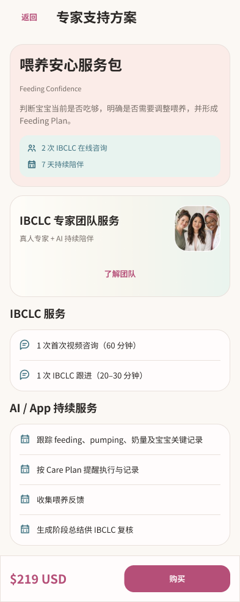
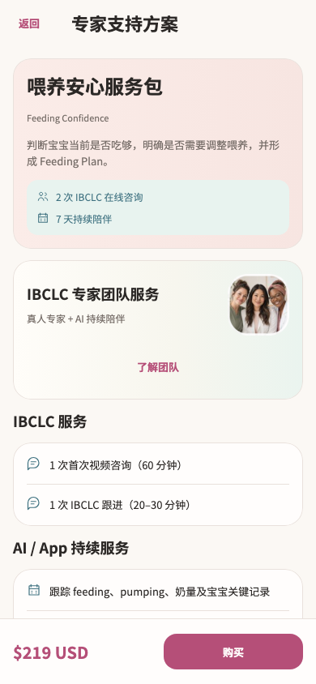
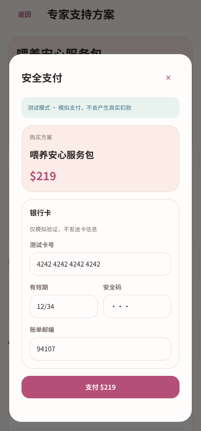
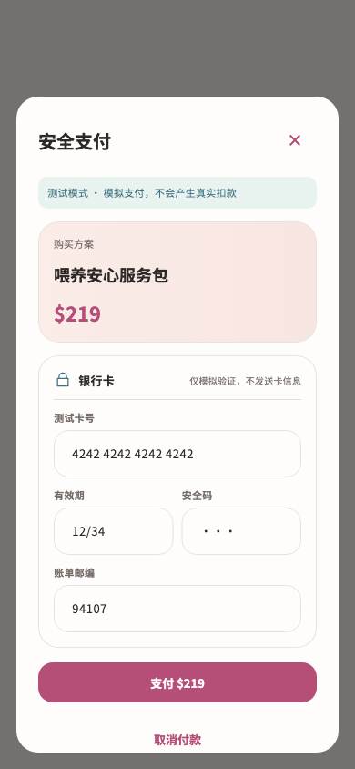

# 服务方案详情与购买 · Figma → Flutter

本轮完成已有截图中的四个 `/services/:packageId` 详情和共用购买弹窗。全量页面重构继续进行；服务进度、预约、续购页面、资料表单和咨询房间仍按各自截图推进。

详情从平铺交付清单改为方案摘要、专家团队发现、两组交付内容和固定底部操作。已购方案在摘要中显示“我的陪伴计划”、状态、当前阶段、实际专家身份与剩余咨询次数，并提供原服务进度入口。未分配专家时显示中性头像和原确认说明。

购买沿用妈妈页的奶油背景、浅粉摘要、薄荷提示和玫瑰色操作，标题与关闭按钮固定，正文独立滚动。正常宽度的有效期与安全码并排，窄屏大字时分行。

## 设计证据

- [Figma 方案详情](https://www.figma.com/design/ePIoJkiMiXiug9ibpcgRbl?node-id=156-1108)
- [Figma 已购服务](https://www.figma.com/design/ePIoJkiMiXiug9ibpcgRbl?node-id=156-1380)
- [Figma 购买前确认](https://www.figma.com/design/ePIoJkiMiXiug9ibpcgRbl?node-id=156-1993)
- [Figma 付款表单](https://www.figma.com/design/ePIoJkiMiXiug9ibpcgRbl?node-id=156-2445)
- [Figma 大字付款](https://www.figma.com/design/ePIoJkiMiXiug9ibpcgRbl?node-id=159-1197)
- [Figma 流程弹窗组件](https://www.figma.com/design/ePIoJkiMiXiug9ibpcgRbl?node-id=158-1234)

共 15 个详情画板和 26 个购买画板，另有一个共享组件，完整记录见 [节点清单](figma-nodes.json)。详情覆盖四种方案、已购、暂停、待付款、支付未开放、加载、错误、缺失方案、保留内容的刷新错误、正在打开订单及大字。购买覆盖资格确认、区域限制、订单失败、测试卡验证、处理中、拒付、银行验证、取消、结果未确认、查询与权益同步、成功，以及 Stripe 跳转、失败和查询状态。

先使用实际 Figma 工具建立设计，再实现 Flutter；读取详情和弹窗的设计上下文，并在视觉检查后对齐普通字号的双列卡字段。布局复用已有妈妈页变量、字体、团队合照和服务目录组件。源截图清单中 38 个实际详情路由条目保存在 [截图依据](source-inventory.json)，其中包含购买及团队弹窗状态。

| Figma | Flutter |
| --- | --- |
|  |  |
|  |  |

另见 [已购 Figma](figma-owned.png)、[已购 Flutter](flutter-owned.png)、[大字已购操作](flutter-owned-large.png)、[大字付款成功 Figma](figma-success-large.png)、[大字付款成功 Flutter](flutter-success-large.png)。Figma 完整详情表示滚动内容，Flutter 底部操作固定在可视区。弹窗画板表示当前滚动位置，后续操作仍可通过滚动到达。字体、原生控件和测试数据会产生细微尺寸差异。

## 实现与业务边界

- `service_package_page.dart` 使用共享 `MomServicePrice`、`MomServicePackageFacts`、`MomProviderTeamCard`、`MomProviderIdentity` 和妈妈页视觉变量。完整方案名称移到摘要，导航标题统一为“专家支持方案”。
- 详情原有优先级保留：进行中 episode 的预约入口优先于待付订单；无 episode 时才继续付款或购买。这与目录原有的待付订单优先级不同，本轮未改变该业务差异。
- `_purchase`、付款 `_act` 和 `_openCheckout` 与改版前逐段比较保持一致。支付 controller、repository、订单状态机、路由和网络接口均未改动。
- `MomSettingsFlowDialog` 只负责最大宽高、固定标题、44 点关闭按钮和滚动正文。购买调用方继续负责不可点击遮罩关闭、忙碌时禁用关闭及 `PopScope` 返回拦截；没有将这些策略移入共享外观组件。
- 区域确认、非紧急医疗说明、测试支付标识、Stripe 模式文案、卡号验证、未确认付款的原订单重试、只读卡字段、取消与查询操作全部保留。成功后“开始预约”和“稍后预约”仍返回原结果。
- 通用专家合照用于团队发现；具体专家来自 provider 数据，未将通用照片映射为具名专家头像。

## 验证

最终联合回归 **134 项通过**，6 个相关文件静态分析无问题。证据：[测试日志](tests.log)、[静态分析](analyze.log)、[文件指纹](verified-files.json)。

覆盖 320/390/430 宽度和 1x/2x 字号下的四方案导航、资格确认、拒付、银行验证、成功预约、取消订单、Stripe 打开失败及结果查询。320×568 双倍字号测试包含 250 点键盘遮挡、验证失败、处理中返回拦截、关闭禁用、结果未确认后保留测试卡与同一付款结果重试。

新增 4 项详情测试覆盖 393/1x、320/2x 的加载、失败重试、缺失方案，以及暂停 episode 与待付款订单同时存在时的原预约优先级。验证服务进度回调传回同一 episode，浏览与跳转均不创建订单或付款。为 320/2x 购买关键状态补充视觉基线。

现有专家入口基线偶发在合照解码前截取；测试现在显式等待该素材加载再截图，没有更改生产页面。购买忙碌测试由查找旧文字关闭按钮改为检查带“关闭购买”标签的图标按钮。

```sh
flutter test --no-pub test/modules/services/service_purchase_test.dart test/modules/services/service_package_redesign_test.dart test/modules/services/service_catalog_states_test.dart test/modules/services/service_design_test.dart test/modules/services/service_renew_test.dart test/modules/services/service_catalog_redesign_test.dart test/modules/mom/mom_home_handoff_test.dart test/app/more_design_test.dart test/app/more_redesign_states_test.dart
flutter analyze --no-pub lib/modules/services/presentation/service_package_page.dart lib/modules/services/presentation/service_purchase_dialog.dart lib/shared/widgets/mom_settings_widgets.dart test/modules/services/service_purchase_test.dart test/modules/services/service_package_redesign_test.dart test/modules/services/service_design_test.dart
```

未运行 Session A 的截图写入测试，未重新采集原生设备截图，未发起真实付款、构建或发布 App。

## 增量交接

此前新增的 49 个通知权限条目已核对路由、触发条件、代表截图及现有实现，标为沿用现有设计，见 [复核记录](notification-review.json)。本轮末清单新增 45 个通知导航状态，已保存到待审队列；最后观察数量和队列状态以 [进度](../progress.json) 与 [待审队列](../pending-inventory.json) 为准。截图状态数量不等于独立页面数量。

下一候选为已有截图中的 `/services/episodes/:id` 服务进度，并复核新增通知目标导航是否引入未覆盖状态。完整任务保持 active。
