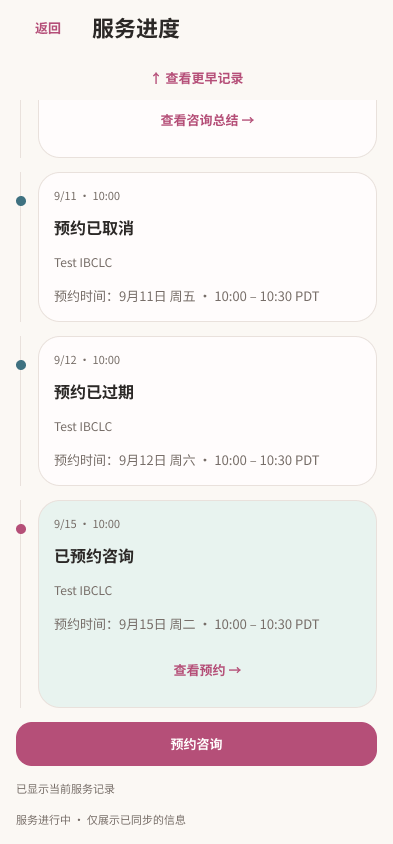
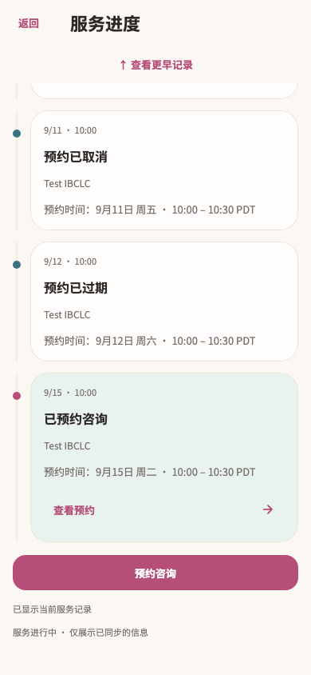
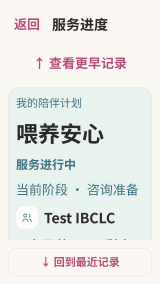
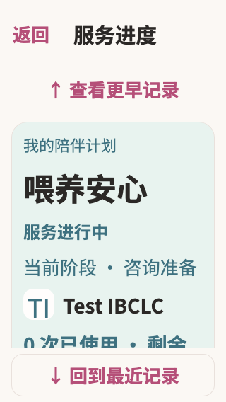

# 服务进度 · Figma → Flutter

本轮完成已有截图中的 `/services/episodes/:episodeId` 服务进度。整体重构持续进行；预约、续购页面、咨询准备和总结页面仍按各自截图推进。

旧页面把专家摘要固定在顶部，时间另占一列，短屏大字下记录区较小。新版将计划摘要与事件放在同一滚动区，卡内呈现日期与时间，突出当前阶段、服务状态及咨询次数。进入页面仍自动定位最近记录；“查看更早记录”返回摘要和最早记录。

## Figma 与截图依据

- [当前计划](https://www.figma.com/design/ePIoJkiMiXiug9ibpcgRbl?node-id=162-1108)
- [完整历史](https://www.figma.com/design/ePIoJkiMiXiug9ibpcgRbl?node-id=162-1139)
- [最近记录视口](https://www.figma.com/design/ePIoJkiMiXiug9ibpcgRbl?node-id=162-1636)
- [短屏大字视口](https://www.figma.com/design/ePIoJkiMiXiug9ibpcgRbl?node-id=163-1108)
- [事件卡组件](https://www.figma.com/design/ePIoJkiMiXiug9ibpcgRbl?node-id=162-1713)

共 17 个画板及 1 个组件，见 [节点清单](figma-nodes.json)。覆盖进行中、准备中、暂停、完成、取消、完整历史、咨询中、首次加载/失败、缺失服务、预约加载/失败、长名称、大字及最近/早期视口。

本轮阅读 17 个对应路由的源截图条目，记录在 [截图依据](source-inventory.json)；检查了代表性的完成、取消预约、最近记录、加载、失败和短屏大字截图。先在 Figma 复用现有变量及卡片建立新版布局，再读取事件卡设计上下文实现 Flutter。未把其他服务目标路由算作本页完成范围。

| Figma | Flutter |
| --- | --- |
|  |  |
|  |  |

另见 [完整计划设计](figma-default.png)、[早期记录](flutter-earlier.png)、[预约读取失败](flutter-offline.png)、[完成服务](flutter-completed.png)。Figma 的完整历史是滚动内容示意；运行时保留自动定位最近记录。阶段与日期由各测试数据决定，不根据服务状态推断或伪造阶段进度。

## 实现与原行为

- `service_progress_page.dart` 使用 `momSettingsTheme`、共享状态卡和页面边距。标题与正文采用妈妈页字体，正文裁切在实际视口内。
- `service_timeline.dart` 的薄荷摘要显示计划名、状态、实际阶段、专家身份、已用/剩余咨询次数和服务天数。专家仍按原逻辑选择最近一个未取消、未过期预约的 providerName；没有把通用专家合照当作具体人物头像。
- 新增共享 `MomTimelineEvent`，对应 Figma `MomCozy/TimelineEvent`：时间、标题、作者、说明和可选动作统一排在卡内，最近事件使用薄荷表面与玫瑰色节点。调用方负责事件含义和动作权限。
- 大字时“回到最近记录”放入独立底部操作区，正文高度随之收缩，避免浮动按钮遮盖文字。普通字号保留浮动入口。摘要和记录均可完整滚动。
- `_reload`、事件构建/排序、`_latest` 与滚动监听逐段比较保持一致。held 预约仍不进入时间线，其他 episode 的预约仍被过滤；取消和过期记录没有可点击动作；完成咨询仍走原总结入口。
- 预约仍使用 `episode.canBook`，继续支持仍使用 `!episode.ongoing && onRenew != null`。计数保持原负数防护及范围约束。没有修改 controller、repository、路由、支付或预约提交逻辑。

## 验证

最终联合回归 **133 项测试通过**，4 个相关文件静态分析无问题：[测试日志](tests.log)、[分析日志](analyze.log)、[验证指纹](verified-files.json)。

服务进度专项 18 项：320/390/430 宽度、1x/2x 字号、最近与早期记录跳转、预约/总结回调、各服务状态预约权限、完成后续购、预约读取失败恢复、读取期间离页、缺失服务及 320×568 大字屏幕。新增测试覆盖首次服务读取失败与刷新失败恢复，以及长方案名称下的短屏滚动和操作可达性。

联合回归包含服务目录/详情与进度的现有设计测试、购买、续购、详情新增状态、妈妈首页和 More。关键视觉基线更新后，以不更新基线的命令重新验证通过：

```sh
flutter test --no-pub test/modules/services/service_progress_test.dart test/modules/services/service_design_test.dart test/modules/services/service_renew_test.dart test/modules/services/service_package_redesign_test.dart test/modules/services/service_purchase_test.dart test/modules/mom/mom_home_handoff_test.dart test/app/more_design_test.dart
flutter analyze --no-pub lib/modules/services/presentation/service_progress_page.dart lib/modules/services/presentation/service_timeline.dart lib/shared/widgets/mom_timeline_event.dart test/modules/services/service_progress_test.dart
```

未运行 Session A 的截图写入测试，未重采集原生设备截图，未构建或发布 App。

## 增量交接

本轮开始无新增截图，结束时观察到 61 个新增服务相关状态，已进入待审队列。此前 45 个通知导航增量仍需逐路由复核；本轮仅将其中实际服务进度目标条目标为本页覆盖。最后清单数量及状态以 [总进度](../progress.json) 和 [待审队列](../pending-inventory.json) 为准，截图状态数不是独立页面数。

后续先核对新增状态是否已被目录、详情、购买或通知设计覆盖，再继续已有截图中的预约页面。完整任务保持 active。
